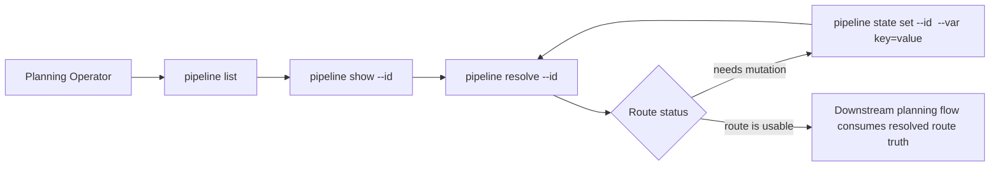
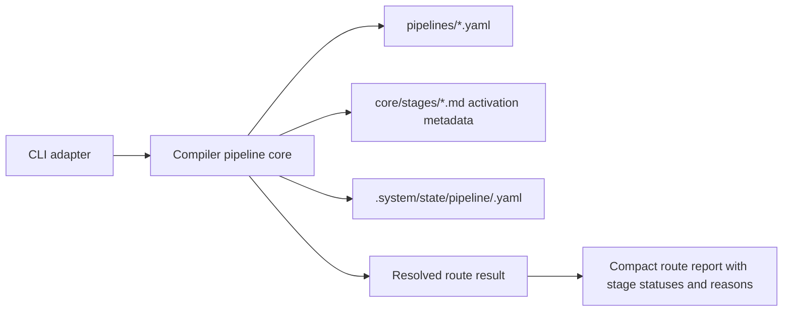
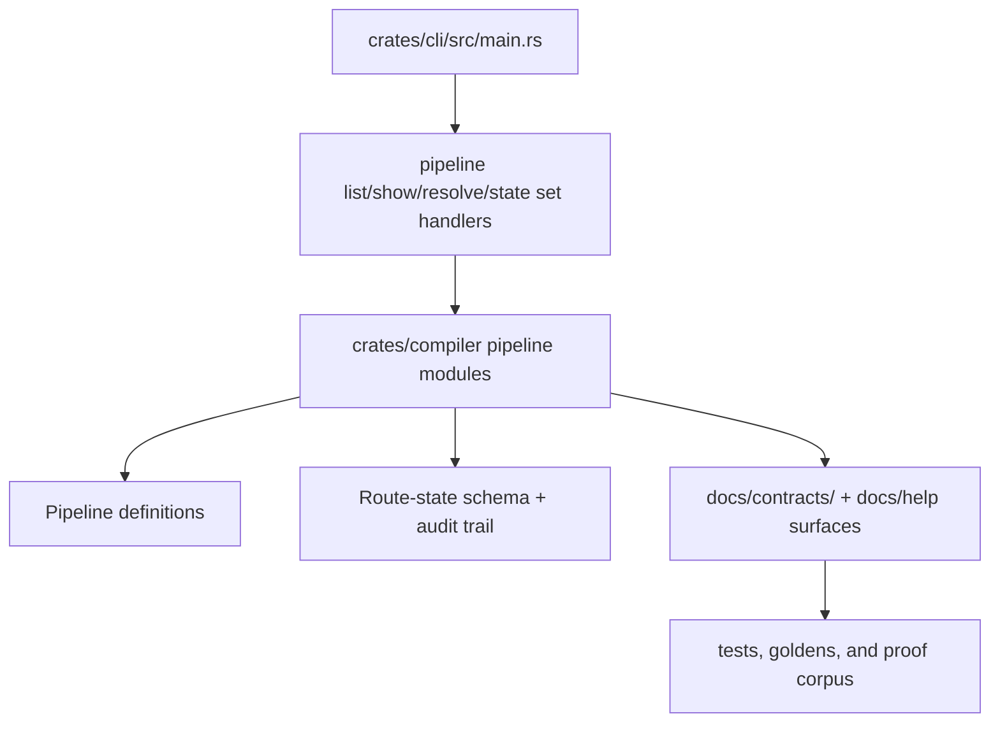

# Review Surfaces - M1 Pipeline And Routing Spine

These diagrams orient the pack. They show the actual product/work shape expected to land for `M1`.
They do not, by themselves, satisfy seam-local pre-exec review.

Active and next seams still require seam-local `review.md` artifacts later.

## R1 - Operator workflow

## R2 - Compiler route-truth flow

## R3 - Touch surface map

