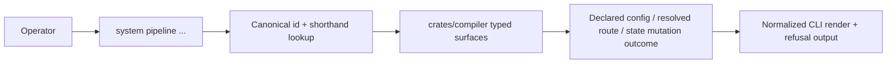
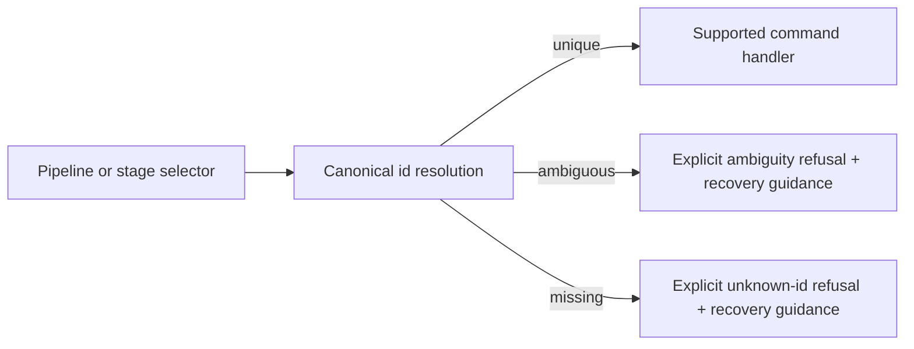

# Review Bundle - SEAM-2 Pipeline Operator Surface and ID Resolution

This artifact feeds `gates.pre_exec.review`.
`../../review_surfaces.md` is pack orientation only.

## Falsification questions

- Can CLI command handlers still fracture route truth away from the compiler because `pipeline resolve` or `pipeline state set` reinterpret `C-08` locally instead of consuming typed compiler-owned surfaces?
- Can shorthand lookup or unknown-id handling blur into one vague refusal path, leaving the operator unable to distinguish ambiguity from absence?
- Can the shipped `pipeline` help posture drift into a partial or packet-shadow surface because command exposure, render contracts, and proof expectations are not pinned together?

## R1 - Operator surface flow

## R3 - Ambiguity and recovery flow

## Likely mismatch hotspots

- `SEAM-1` now publishes the route/state truth, so this seam must keep CLI wrappers thin and compiler-owned semantics authoritative.
- The command family is intentionally limited to `list`, `show`, `resolve`, and `state set`; stray help exposure or packet-alias behavior would violate the shipped-surface contract.
- Canonical-id and shorthand ergonomics are useful, but they must stay deterministic and auditable once more pipeline or stage ids exist.

## Pre-exec findings

- `THR-01` is now published by `SEAM-1`, and the seam basis is current against the realized route/state closeout.
- The owned operator-surface contract work is concrete enough to execute: `S00` defines the canonical `C-09` baseline and the remaining slices separate discovery, command behavior, and conformance/help evidence cleanly.
- No blocking pre-exec remediations remain open for this seam.

## Pre-exec gate disposition

- **Review gate**: passed
- **Contract gate**: passed
- **Contract gate concerns**: none blocking. The owned `C-09` baseline is concrete in `S00`, and publication remains seam-exit evidence rather than a pre-exec dependency.
- **Revalidation prerequisites**:
  - Keep the basis current against the published `SEAM-1` closeout and any future `C-08` stale triggers.
  - Keep the basis current against `C-02` help-order and supported-command posture.
- **Opened remediations**: none
- **Promotion result**: `SEAM-2` is ready for `exec-ready`; publication still depends on landing, seam exit, and `THR-02` closeout evidence.

## Planned seam-exit gate focus

- **What must be true before downstream promotion is legal**:
  - `C-09` is concrete, landed, and consistent with CLI handlers, help posture, and tests.
  - `THR-02` is published with closeout evidence for canonical-id semantics, resolve/state-set behavior, and supported help posture.
  - `SEAM-3` and `SEAM-4` receive explicit stale triggers for later operator-surface drift.
- **Which outbound contracts/threads matter most**: `C-09`, `THR-02`
- **Which review-surface deltas would force downstream revalidation**:
  - any change to supported `pipeline` subcommands or help exposure
  - any change to canonical-id or shorthand ambiguity semantics
  - any change to normalized render wording or refusal classification for `resolve` and `state set`
