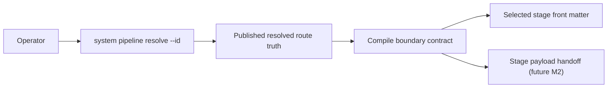
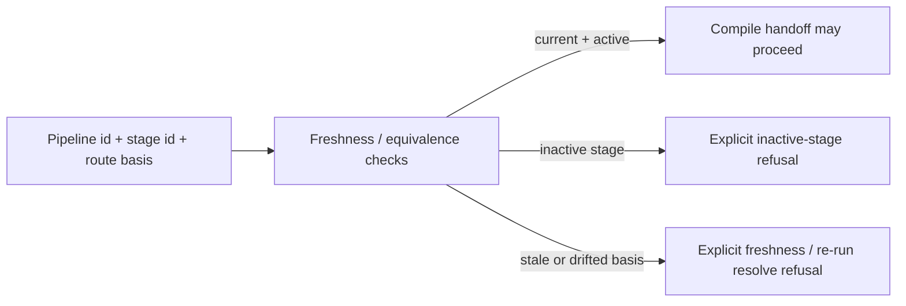

# Review Bundle - SEAM-3 Stage Compile Boundary and Route Freshness Handoff

This artifact feeds `gates.pre_exec.review`.
`../../review_surfaces.md` is pack orientation only.

## Falsification questions

- Can the future compile boundary silently recompute route selection instead of consuming the published `pipeline resolve` truth from the compiler and operator surface?
- Can pipeline YAML and stage front matter drift on activation or target-selection semantics without one explicit equivalence or refusal rule?
- Can compile proceed against stale route basis, inactive stages, or missing freshness inputs without telling the operator to re-run `pipeline resolve`?

## R1 - Compile handoff flow

## R2 - Freshness and refusal flow

## Likely mismatch hotspots

- `SEAM-2` now publishes the operator-facing selection rules, so this seam must reuse canonical-id and shorthand semantics instead of inventing compile-only targeting behavior.
- `SEAM-1` owns route truth and route-state semantics, so freshness checks must consume that basis rather than recomputing route selection inside compile-boundary logic.
- `pipeline compile` remains deferred from the shipped M1 help surface, so this seam must stay contract- and handoff-oriented without widening product exposure.

## Pre-exec findings

- `THR-01` and `THR-02` are now published by landed upstream closeouts, and the seam basis is current against the realized route/state and operator-surface handoff.
- The owned compile-boundary contract work is concrete enough to execute: `S00` defines the canonical `C-10` baseline and the remaining slices separate selection/source-of-truth rules, freshness/refusal behavior, and activation-drift or payload-handoff rules cleanly.
- No blocking pre-exec remediations remain open for this seam.

## Pre-exec gate disposition

- **Review gate**: passed
- **Contract gate**: passed
- **Contract gate concerns**: none blocking. The owned `C-10` baseline is concrete in `S00`, and publication remains seam-exit evidence rather than a pre-exec dependency for this producer seam.
- **Revalidation prerequisites**:
  - Keep the basis current against the landed `SEAM-1` route/state closeout and any future `C-08` stale triggers.
  - Keep the basis current against the landed `SEAM-2` operator-surface closeout and any future `C-09` stale triggers.
- **Opened remediations**: none
- **Promotion result**: `SEAM-3` is ready for `exec-ready`; publication still depends on landing, seam exit, and `THR-03` closeout evidence.

## Planned seam-exit gate focus

- **What must be true before downstream promotion is legal**:
  - `C-10` is concrete, landed, and consistent with the published route/operator handoff and the planned compile freshness boundary.
  - `THR-03` is published with closeout evidence for compile-target selection, route freshness, inactive-stage refusal, and activation-equivalence posture.
  - `SEAM-4` receives explicit stale triggers for later docs/help and proof-corpus drift.
- **Which outbound contracts/threads matter most**: `C-10`, `THR-03`
- **Which review-surface deltas would force downstream revalidation**:
  - any change to compile-target selection or canonical-id requirements
  - any change to freshness inputs or inactive-stage refusal classes
  - any change to activation-equivalence or stage-payload boundary rules
