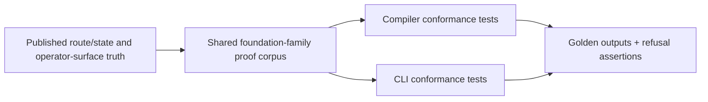
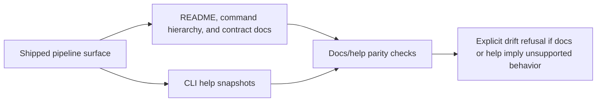

# Review Bundle - SEAM-4 Validation Rails, Proof Corpus, and Docs Realignment

This artifact feeds `gates.pre_exec.review`.
`../../review_surfaces.md` is pack orientation only.

## Falsification questions

- Can the proof corpus diverge between compiler and CLI tests because the seam does not pin one realistic foundation-family fixture set and shared golden outputs?
- Can docs or help text drift away from the shipped `pipeline` contract because parity checks are not tied to the same seam-local planning bundle?
- Can malformed-state refusals, concurrency boundaries, or performance/security expectations become vague because the seam does not keep them explicit in conformance planning?

## R1 - Proof corpus and goldens flow

## R2 - Docs and help parity flow

## Likely mismatch hotspots

- `SEAM-1` owns route/state semantics, so proof fixtures must keep route truth and state mutation semantics stable instead of reinterpreting them locally.
- `SEAM-2` owns operator-surface exposure, so docs and help parity must preserve the supported `pipeline` subset without widening command claims.
- `SEAM-3` owns the compile defer boundary, so any docs/help language that implies shipped `pipeline compile` behavior must be treated as drift.

## Pre-exec findings

- `THR-01`, `THR-02`, and `THR-03` are published, and the seam basis is current against the landed route/state, operator-surface, and compile-boundary closeouts.
- The seam-local planning scaffold is concrete enough to execute: `S00` defines the owned `C-11` baseline, and the remaining slices separate proof corpus, docs/help parity, and safety rails cleanly.
- No blocking pre-exec remediations remain open for this seam.

## Pre-exec gate disposition

- **Review gate**: passed
- **Contract gate**: passed
- **Contract gate concerns**: none blocking. The owned `C-11` baseline is concrete in `S00`, and final publication remains seam-exit evidence rather than a pre-exec dependency for this producer seam.
- **Revalidation prerequisites**:
  - Keep the basis current against any later `SEAM-1`, `SEAM-2`, or `SEAM-3` stale triggers.
- **Opened remediations**: none
- **Promotion result**: `SEAM-4` is ready for `exec-ready`; publication still depends on landing `C-11` and seam-exit evidence.

## Planned seam-exit gate focus

- **What must be true before downstream promotion is legal**:
  - `C-11` is concrete, landed, and consistent with the proof corpus, docs/help parity, and safety rails planned here.
  - `THR-04` is published with closeout evidence for the proof corpus, docs/help parity, and downstream stale-trigger record.
  - Later milestone packs receive explicit stale triggers for proof-corpus, help/docs, and safety-boundary drift.
- **Which outbound contracts/threads matter most**: `C-11`, `THR-04`
- **Which review-surface deltas would force downstream revalidation**:
  - any change to proof corpus shape or golden outputs
  - any change to docs/help claims for the shipped `pipeline` subset
  - any change to malformed-state refusals, lock/revision conflict handling, or performance/security boundaries
