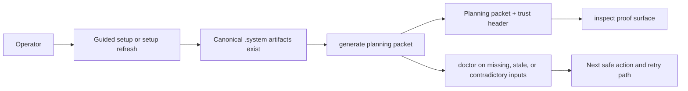
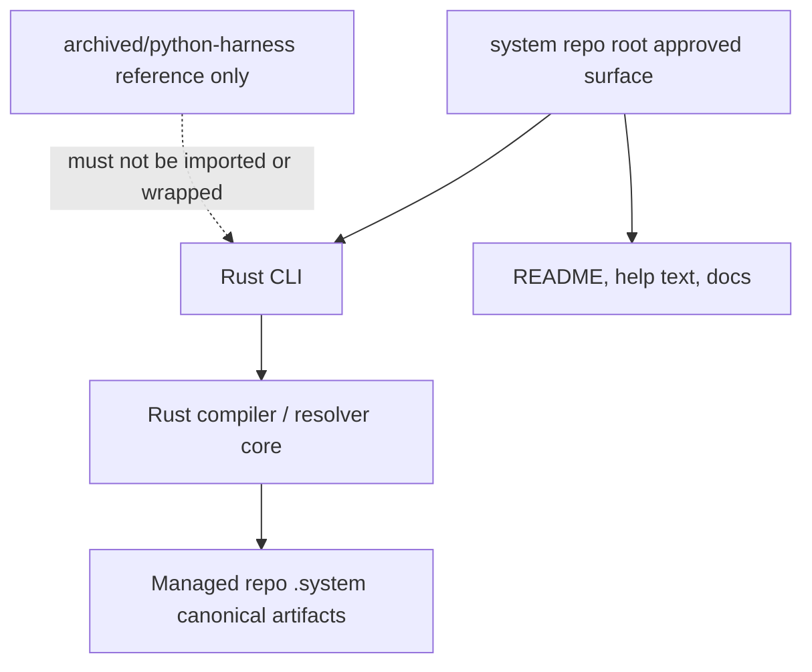
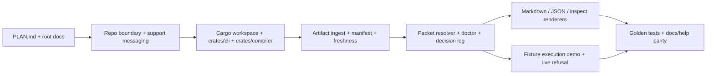

# Review Surfaces - Reduced V1 Rust-First CLI Cutover

These diagrams orient the pack. They show the actual product/work shape expected to land in reduced v1.
They do not, by themselves, satisfy seam-local pre-exec review.
Active and next seams still require seam-local `review.md` later.

## R1 - Operator workflow

## R2 - Runtime boundary and product surface

## R3 - Touch surface map

