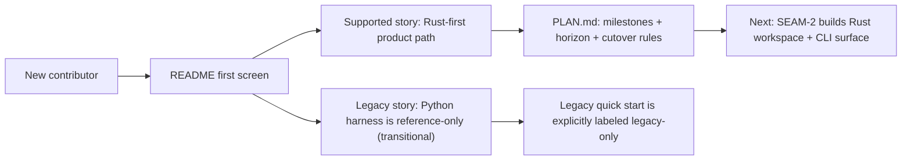
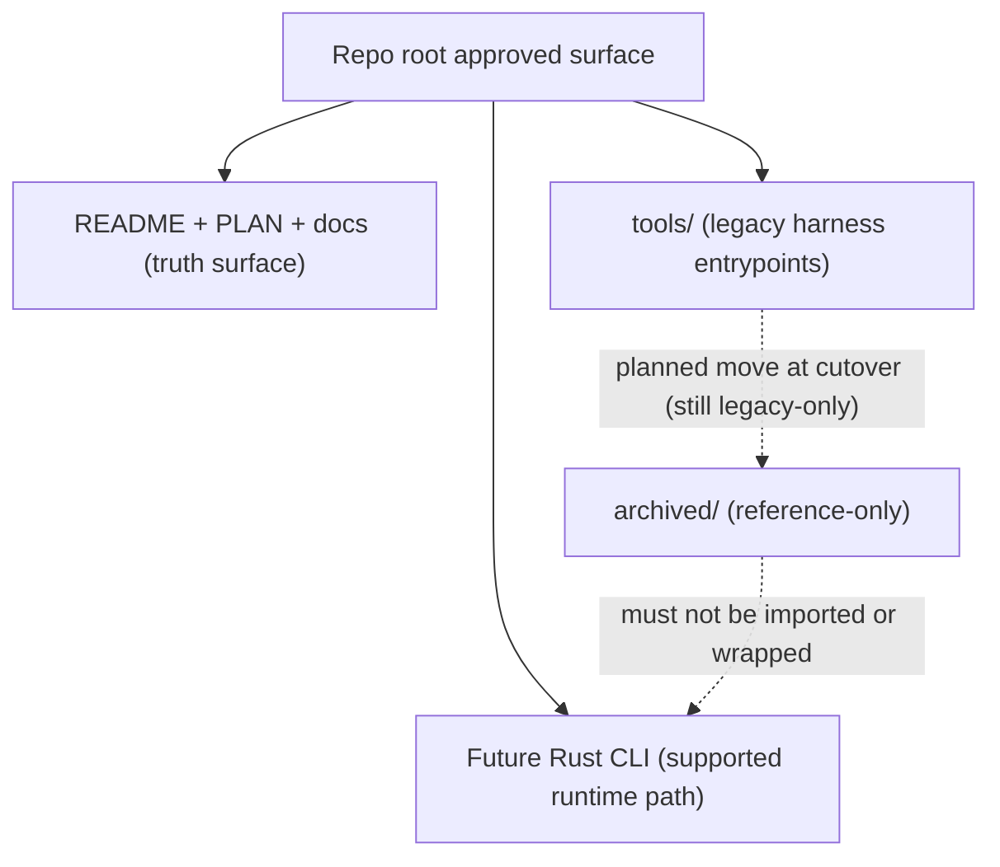

# Review Bundle - SEAM-1 Approved Surface and Legacy Freeze

This artifact feeds `gates.pre_exec.review`.
`../../review_surfaces.md` is pack orientation only.

## Falsification questions

- Can a new contributor still plausibly believe "Python is supported" because the only runnable path is the legacy harness, despite the Rust-first messaging?
- Does any root-facing copy imply the Rust CLI exists today (or that setup is already reimplemented in Rust), creating a trust gap between docs and reality?
- Is the archive/runtime boundary ambiguous enough that a future change could accidentally wire `archived/` into the supported runtime path?

## R1 - Supported vs legacy discovery flow

## R2 - Runtime boundary (no archived dependency)

## Likely mismatch hotspots

- Root docs drift: README, PLAN, and docs index stop using the exact same supported-vs-legacy wording.
- Transitional confusion: legacy quick start reads like the supported story because it contains the only concrete commands.
- Future regression risk: adding `archived/` examples or wrappers that later get treated as supported runtime dependencies.

## Pre-exec findings

- None opened in this decomposition pass. Contract-definition slice `S00` is expected to surface any copy/structure blockers while concretizing `C-01`.

## Pre-exec gate disposition

- **Review gate**: passed
- **Contract gate concerns**: `C-01` must be concrete (rules + verification checklist) before `SEAM-1` can become `exec-ready`.
- **Revalidation prerequisites**:
  - Once `C-01` lands, `SEAM-2` and `SEAM-7` basis must revalidate against the published repo-surface truth.
- **Opened remediations**: none

## Planned seam-exit gate focus

- **What must be true before downstream promotion is legal**:
  - `C-01` is concrete, landed, and represented consistently across root docs and entrypoints.
  - `THR-01` can be marked published in closeout with explicit evidence.
- **Which outbound contracts/threads matter most**: `C-01`, `THR-01`
- **Which review-surface deltas would force downstream revalidation**:
  - any change to supported-vs-legacy wording
  - any change to archive timing or archive/runtime boundary policy
  - any new claim that Rust owns a flow that still depends on legacy harness behavior
