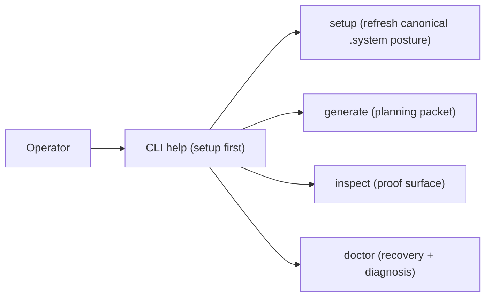
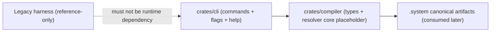

# Review Bundle - SEAM-2 Rust Workspace and CLI Skeleton

This artifact feeds `gates.pre_exec.review`.
`../../review_surfaces.md` is pack orientation only.

## Falsification questions

- Could the workspace/crate split still allow ambiguous ownership (CLI vs compiler core), leading downstream seams to add behavior in the wrong crate?
- Can the command surface drift from `PLAN.md` (verbs, hierarchy, help posture) without a contract update, causing downstream seams to plan against the wrong CLI UX?
- Does the skeleton accidentally imply a supported runtime path that still depends on legacy Python harness behavior (violating `C-01`)?

## R1 - Operator-facing command hierarchy (reduced v1)

## R2 - Ownership flow (CLI -> compiler core)

## Likely mismatch hotspots

- Verb naming drift (including `doctor` posture) between `PLAN.md`, `threading.md` contract definition, and the eventual `C-02` rules.
- Workspace membership and crate boundaries drift as new modules appear (temptation to add behavior into CLI instead of compiler core).
- Help posture that becomes “generate-first” instead of “setup-first”, weakening the trust pipeline described in review surfaces.

## Pre-exec findings

- None opened in this decomposition pass. Contract-definition slice `S00` is expected to surface any naming/ownership ambiguities while concretizing `C-02`.

## Pre-exec gate disposition

- **Review gate**: passed
- **Contract gate**: passed (contract-definition slice `S00` carries the concrete `C-02` baseline work plan and verification checklist requirements).
- **Revalidation gate**: passed (revalidated against `SEAM-1` closeout and the published `C-01` repo-surface contract).
- **Opened remediations**: none

## Planned seam-exit gate focus

- **What must be true before downstream promotion is legal**:
  - `C-02` rules and verification checklist are landed and consistent with `PLAN.md` + `threading.md`.
  - Basic CLI help proves the verb skeleton and “setup-first” posture.
  - Crate boundaries are enforced enough that downstream seams can implement without cross-crate ambiguity.
- **Which outbound contracts/threads matter most**: `C-02`, `THR-02`
- **Which review-surface deltas would force downstream revalidation**:
  - any rename of supported verbs or changes to help hierarchy/order
  - any change to crate ownership split that affects where behavior is expected to land
  - any new claim that the supported runtime path depends on legacy harness behavior
