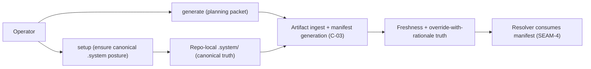
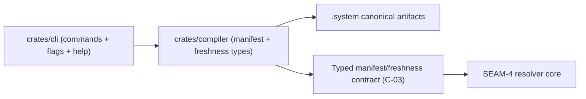

# Review Bundle - SEAM-3 Canonical Artifact Manifest Contract

This artifact feeds `gates.pre_exec.review`.
`../../review_surfaces.md` is pack orientation only.

## Falsification questions

- Can the system still “accidentally” treat derived docs (README, PLAN snippets, renderer output) as canonical runtime inputs instead of `.system/` artifacts?
- Can new artifacts, refusal sources, or inherited dependencies silently expand the manifest without a `C-03` version bump and downstream revalidation?
- Do override-with-rationale rules allow an override to hide freshness truth (or to smuggle in extra semantics) without an explicit, inspectable rationale record?

## R1 - Canonical ingest and manifest flow (reduced v1)

## R2 - Ownership + data flow (CLI -> compiler core -> filesystem)

## Likely mismatch hotspots

- `.system/` canonical path rules vs repo-surface rules (`C-01`) and CLI “setup-first” posture (`C-02`).
- Optional `PROJECT_CONTEXT` semantics: omission vs empty vs stale vs refused must be explicit in the contract.
- Inherited posture dependencies: ensure they affect freshness deterministically without becoming implicit packet-body inputs.
- Override-with-rationale precision: define exactly what can be overridden, how rationale is recorded, and what is forbidden.
- Versioning split: “schema version” vs “manifest generation version” must be unambiguous and monotonic.

## Pre-exec findings

- None opened in this decomposition pass. The contract-definition slice `S00` is expected to surface any ambiguity while concretizing `C-03`.

## Pre-exec gate disposition

- **Review gate**: passed
- **Contract gate focus**:
  - `C-03` must name all direct inputs and refusal sources explicitly (no “implied” inputs).
  - `C-03` must define deterministic freshness computation and a clear versioning policy.
  - `C-03` must define override-with-rationale rules that cannot hide or falsify freshness truth.
- **Contract gate**: passed (contract-definition slice `S00` carries the concrete `C-03` baseline work plan and verification checklist requirements).
- **Revalidation**: passed (revalidated against `SEAM-2` closeout and published `C-02` / `THR-02`).
- **Opened remediations**: none

## Planned seam-exit gate focus

- **What must be true before downstream promotion is legal**:
  - `C-03` is concrete (rules + verification checklist) and matches `threading.md` contract registry language.
  - Canonical ingest and manifest generation are implemented in `crates/compiler` without reading non-canonical derived sources.
  - `THR-03` is publishable with explicit closeout evidence and explicit downstream revalidation triggers.
- **Which outbound contracts/threads matter most**: `C-03`, `THR-03`
- **Which review-surface deltas would force downstream revalidation**:
  - any new direct artifact input or refusal source
  - any change to freshness fields or their computation rules
  - any change to override-with-rationale semantics
