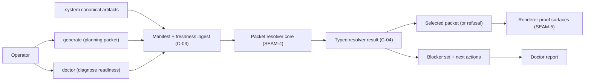
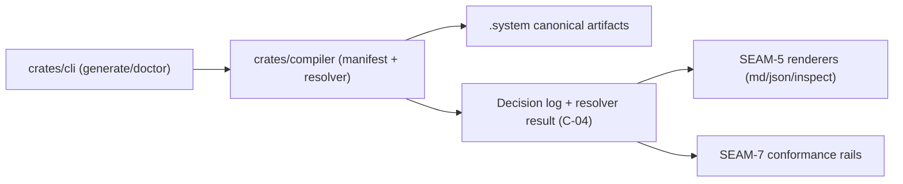

# Review Bundle - SEAM-4 Planning Packet Resolver and Doctor

This artifact feeds `gates.pre_exec.review`.
`../../review_surfaces.md` is pack orientation only.

## Falsification questions

- Can `generate` and `doctor` diverge on what is blocked (or on what the “next safe action” is) because they compute blockers separately?
- Can the same canonical inputs yield different packet selection, different refusal, or different decision-log ordering (non-determinism, hidden time dependence, or unstable iteration order)?
- Can budget behavior “fail closed” without an inspectable reason and without an exact recovery action (turning budget into an opaque failure mode)?

## R1 - Operator workflow (generate vs doctor share one resolver truth)

## R2 - Ownership + data flow (CLI -> compiler core -> renderers)

## Likely mismatch hotspots

- Freshness and packet-input semantics (`C-03`) shifting after this seam is decomposed (revalidation is required before execution).
- Stable ordering: decision-log and blocker lists must be deterministic even when derived from maps/sets.
- Refusal coupling: refusal semantics must be tied to the resolver result, not to renderer wording (`SEAM-5`) or ad hoc CLI branches.
- Budget outcomes: must be typed, inspectable, and include a single “next action” path that is safe to follow.
- Blocker taxonomy: must not force downstream seams (`SEAM-5`, `SEAM-7`) to infer meaning from freeform strings.

## Pre-exec findings

- None opened in this decomposition pass. The contract-definition slice `S00` is expected to surface any ambiguity while concretizing `C-04`.

## Pre-exec gate disposition

- **Review gate**: passed
- **Contract gate focus**:
  - `C-04` defines the resolver result, decision-log fields, refusal structure, and blocker taxonomy with stable ordering guarantees.
  - `doctor` consumes the same typed resolver truth as `generate` (no parallel blocker computation).
  - Budget outcomes are explicit and carry an exact “next safe action”.
- **Revalidation prerequisites**:
  - `SEAM-3` publishes `C-03` / `THR-03` with closeout-backed evidence so `SEAM-4` can revalidate basis inputs and freshness semantics.
  - Any command-surface deltas in `C-02` / `THR-02` after this decomposition must be reconciled (refusal verbs, `doctor` posture, and help expectations).
- **Revalidation**: passed (basis revalidated against `SEAM-3` closeout + published `THR-03`)
- **Opened remediations**: none

## Planned seam-exit gate focus

- **What must be true before downstream promotion is legal**:
  - `C-04` is concrete (rules + verification checklist) and matches `threading.md` contract registry language.
  - Resolver selection, refusal, and blocker truth are unified under one typed result (no drift between `generate` and `doctor`).
  - `THR-04` is publishable with explicit closeout evidence and explicit downstream revalidation triggers.
- **Which outbound contracts/threads matter most**: `C-04`, `THR-04`
- **Which review-surface deltas would force downstream revalidation**:
  - any change to refusal categories, required refusal fields, or refusal ordering
  - any change to budget policy or budget-outcome classification
  - any change to blocker taxonomy or stable ordering guarantees
  - any change to selection-reason fields or packet identity semantics
