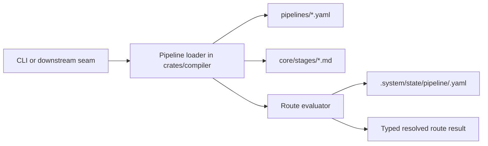
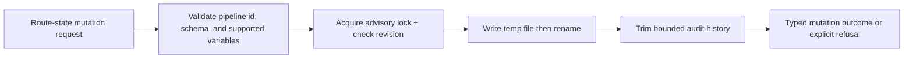

# Review Bundle - SEAM-1 Compiler Pipeline Core and Routing State

This artifact feeds `gates.pre_exec.review`.
`../../review_surfaces.md` is pack orientation only.

## Falsification questions

- Can route truth still fracture between compiler core and CLI surfaces because the resolved-route statuses or reasons are not exposed as one typed compiler-owned model?
- Can `.system/state/pipeline/` silently become canonical project truth or accept last-write-wins mutation behavior because the runtime-zone and mutation rules are not concrete enough?
- Can different entry paths (`pipeline list`, `show`, `resolve`, future compile handoff) end up reinterpreting activation or stage ordering differently because declared pipeline load and route evaluation are not separated cleanly?

## R1 - Compiler route-truth flow

## R2 - Route-state mutation flow

## Likely mismatch hotspots

- `crates/compiler/src/pipeline.rs` already owns pipeline loading, but the seam still needs a clean boundary between declared pipeline ingest and future route-evaluation logic.
- The pack claims explicit `active` / `skipped` / `blocked` / `next` statuses, but there is no landed `C-08` contract or typed route-result surface yet.
- The repo documents `.system/state/**` as runtime-only, but the seam still needs concrete refusal and concurrency rules so persisted route state cannot drift into implicit canonical truth.

## Pre-exec findings

- `REM-001` remains open, but it no longer blocks pre-exec readiness: the canonical route/state baseline now exists at `docs/contracts/pipeline-route-and-state-core.md`, and the remaining work is landing the implementation and seam-exit evidence promised by `S00`, `S2`, and `S3`.

## Pre-exec gate disposition

- **Review gate**: passed
- **Contract gate**: passed
- **Contract gate concerns**: The owned contract baseline is now concrete enough for `exec-ready`. Remaining work is post-exec: land the compiler route/state surfaces, publish `THR-01`, and record seam-exit evidence against the canonical contract.
- **Revalidation prerequisites**:
  - Keep the basis current against the approved `serde_yaml_bw` parser base and the two-document pipeline shape.
  - Keep the basis current against `C-03` runtime-zone wording so `.system/state/**` remains non-canonical.
- **Opened remediations**:
  - `REM-001` now tracks landing and publication evidence for the route/state baseline; it no longer blocks `SEAM-1` from reaching `exec-ready`.

## Planned seam-exit gate focus

- **What must be true before downstream promotion is legal**:
  - `C-08` is concrete, landed, and consistent with compiler code and tests.
  - `THR-01` is published with closeout evidence for route statuses, reason semantics, and state-mutation rules.
  - `SEAM-2`, `SEAM-3`, and `SEAM-4` receive explicit stale triggers for any later route/state contract drift.
- **Which outbound contracts/threads matter most**: `C-08`, `THR-01`
- **Which review-surface deltas would force downstream revalidation**:
  - any change to route status names or state-mutation outcome semantics
  - any change to supported activation syntax or evaluation order
  - any change to `.system/state/pipeline/` schema, audit-history bounds, or mutation concurrency rules
