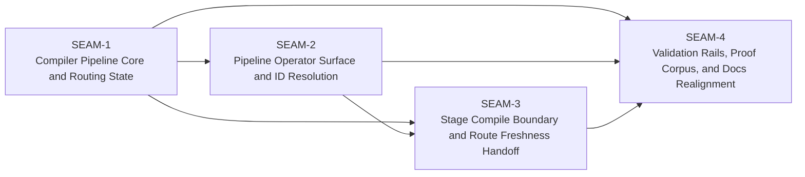

# Threading - M1 Pipeline And Routing Spine

## Execution horizon summary

- Active seam: `SEAM-2`
- Next seam: `SEAM-3`
- Future seams: `SEAM-4`
- Landed seam outside forward window: `SEAM-1`
- Default policy: only the active seam receives authoritative deep planning by default; the next seam is eligible only for provisional seam-local planning later; future seams remain seam briefs.

## Contract registry

- **Contract ID**: `C-08`
  - **Type**: `state`
  - **Owner seam**: `SEAM-1`
  - **Direct consumers**: `SEAM-2`, `SEAM-3`, `SEAM-4`
  - **Derived consumers**: future `M2` compile and `M4` foundation-flow seams
  - **Thread IDs**: `THR-01`
  - **Definition**: Compiler-owned contract for pipeline definition loading, repo-safe path rules, supported activation subset, deterministic route ordering, explicit per-stage route status/reason semantics, and narrow route-state persistence plus mutation protocol.
  - **Canonical contract ref**: `docs/contracts/pipeline-route-and-state-core.md`
  - **Versioning / compat**: Any change to activation semantics, route statuses, state schema, or mutation concurrency rules requires downstream revalidation.

- **Contract ID**: `C-09`
  - **Type**: `API`
  - **Owner seam**: `SEAM-2`
  - **Direct consumers**: `SEAM-3`, `SEAM-4`
  - **Derived consumers**: future operator-facing docs and downstream planning consumers
  - **Thread IDs**: `THR-02`
  - **Definition**: Supported `pipeline` command-family contract covering `list`, `show`, `resolve`, `state set`, canonical ids, shorthand ambiguity rules, normalized CLI render surfaces, and the rule that raw file paths remain evidence rather than first-class operator inputs.
  - **Canonical contract ref**: `docs/contracts/pipeline-operator-surface-and-id-resolution.md`
  - **Versioning / compat**: Any change to supported subcommands, id lookup semantics, route-report wording requirements, or help-surface posture requires downstream revalidation.

- **Contract ID**: `C-10`
  - **Type**: `schema`
  - **Owner seam**: `SEAM-3`
  - **Direct consumers**: `SEAM-4`
  - **Derived consumers**: future `M2` compile implementation and later planning-generation milestones
  - **Thread IDs**: `THR-03`
  - **Definition**: Downstream compile-boundary contract defining source-of-truth split between pipeline YAML and stage front matter, route-basis freshness checks, inactive-stage refusal, and the stage-payload shape expected once compile lands.
  - **Canonical contract ref**: `docs/contracts/stage-compile-boundary-and-route-freshness.md`
  - **Versioning / compat**: Any change to compile freshness inputs, inactive-stage refusal semantics, or activation-drift equivalence rules requires downstream revalidation.

- **Contract ID**: `C-11`
  - **Type**: `config`
  - **Owner seam**: `SEAM-4`
  - **Direct consumers**: none inside this pack
  - **Derived consumers**: future milestone packs, release validation, and operator trust surfaces
  - **Thread IDs**: `THR-04`
  - **Definition**: Conformance contract for proof corpus location, golden-output governance, malformed-pipeline and malformed-state refusal rails, help/docs parity, and the M1 performance/security posture for the `pipeline` family.
  - **Canonical contract ref**: `docs/contracts/pipeline-proof-corpus-and-docs-cutover.md`
  - **Versioning / compat**: Any change to proof-corpus shape, mandatory checks, supported help/docs claims, or latency/security boundaries requires revalidation of downstream milestone packs.

## Thread registry

- **Thread ID**: `THR-01`
  - **Producer seam**: `SEAM-1`
  - **Consumer seam(s)**: `SEAM-2`, `SEAM-3`, `SEAM-4`
  - **Carried contract IDs**: `C-08`
  - **Purpose**: Publish one compiler-owned truth for pipeline loading, route computation, and route-state mutation so every downstream seam stops inferring routing behavior from legacy code or ad hoc CLI wiring.
  - **State**: `published`
  - **Revalidation trigger**: Any change to supported activation syntax, deterministic route ordering, state schema, mutation locking/revision semantics, or the canonical-vs-runtime `.system/` boundary.
  - **Satisfied by**: `SEAM-1` closeout records landed route/state contracts, typed proof outputs, state-file evidence, and a passed seam-exit record for `C-08`.
  - **Notes**: `SEAM-2` is now the active consumer planning window and must preserve the published route/state truth without redefining it in CLI-only terms.

- **Thread ID**: `THR-02`
  - **Producer seam**: `SEAM-2`
  - **Consumer seam(s)**: `SEAM-3`, `SEAM-4`
  - **Carried contract IDs**: `C-09`
  - **Purpose**: Carry the supported `pipeline` command vocabulary, id lookup rules, and compact render contract into compile handoff planning and conformance rails.
  - **State**: `defined`
  - **Revalidation trigger**: Any change to supported `pipeline` subcommands, canonical-id/shorthand behavior, ambiguity refusal copy, or help-surface exposure rules.
  - **Satisfied by**: `SEAM-2` closeout records landed CLI command handlers, help evidence, canonical-id lookup behavior, and published operator-surface contract updates.
  - **Notes**: This thread should not publish until code, help, docs, tests, and proof corpus agree that `pipeline` is a supported surface.

- **Thread ID**: `THR-03`
  - **Producer seam**: `SEAM-3`
  - **Consumer seam(s)**: `SEAM-4`
  - **Carried contract IDs**: `C-10`
  - **Purpose**: Freeze the compile-boundary and route-freshness rules so later `pipeline compile` work cannot reinterpret M1 route truth or stage source-of-truth boundaries.
  - **State**: `defined`
  - **Revalidation trigger**: Any change to route freshness inputs, compile refusal categories, stage-front-matter vs pipeline-YAML ownership, or activation-drift equivalence rules.
  - **Satisfied by**: `SEAM-3` closeout records the accepted compile-boundary contract and seam-exit evidence that downstream compile work can consume without reopening M1 route semantics.
  - **Notes**: This is a future-facing contract seam; it should remain brief-only until `SEAM-1` and `SEAM-2` publish stable upstream truth.

- **Thread ID**: `THR-04`
  - **Producer seam**: `SEAM-4`
  - **Consumer seam(s)**: future `M2`, `M3`, and `M4` seam packs
  - **Carried contract IDs**: `C-11`
  - **Purpose**: Publish the proof-corpus, docs/help, and conformance expectations that make the M1 `pipeline` surface safe to reuse and extend.
  - **State**: `identified`
  - **Revalidation trigger**: Any change to shared proof fixtures, goldens, supported docs/help claims, mandatory test matrix, or the M1 performance/security posture.
  - **Satisfied by**: `SEAM-4` closeout records passing conformance evidence, published contract updates, and the downstream stale triggers that later milestone packs must honor.
  - **Notes**: This thread closes the M1 pack and becomes part of the basis for later milestone promotion.

## Dependency graph

## Critical path

- `SEAM-1` must publish `C-08` before the operator surface can safely claim `pipeline` as supported.
- `SEAM-2` must publish `C-09` before docs/help parity and proof outputs can freeze the shipped surface.
- `SEAM-3` stays future-facing but should define the compile handoff before `SEAM-4` finalizes docs/help copy that references compile as deferred.
- `SEAM-4` closes the pack by binding proof corpus, tests, docs, and performance/security posture to the published upstream contracts.

## Workstreams

- `WS-Compiler-Core`
  - `SEAM-1`
- `WS-Operator-Surface`
  - `SEAM-2`
  - `SEAM-3`
- `WS-Conformance`
  - `SEAM-4`
