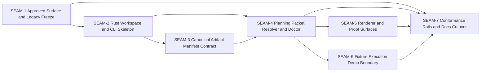

# Threading - Reduced V1 Rust-First CLI Cutover

## Execution horizon summary

- Active seam: `SEAM-4`
- Next seam: `SEAM-5`
- Future seams: `SEAM-6` through `SEAM-7`
- Default policy: only the active seam receives authoritative deep planning by default; the next seam is eligible only for provisional seam-local planning later; future seams remain seam briefs.

## Contract registry

- **Contract ID**: `C-01`
  - **Type**: `config`
  - **Owner seam**: `SEAM-1`
  - **Direct consumers**: `SEAM-2`, `SEAM-7`
  - **Derived consumers**: `SEAM-3`, `SEAM-4`, `SEAM-5`, `SEAM-6`
  - **Thread IDs**: `THR-01`, `THR-07`
  - **Definition**: Approved repo-surface contract covering root layout, Rust-first supported messaging, legacy Python freeze posture, archive/runtime boundary, and the rule that `archived/` is reference-only.
  - **Versioning / compat**: Reduced v1 contract; downstream seams must revalidate if supported-vs-legacy wording, archive timing, or runtime boundary rules change.

- **Contract ID**: `C-02`
  - **Type**: `API`
  - **Owner seam**: `SEAM-2`
  - **Direct consumers**: `SEAM-3`, `SEAM-4`, `SEAM-5`, `SEAM-7`
  - **Derived consumers**: `SEAM-6`
  - **Thread IDs**: `THR-02`
  - **Definition**: Rust workspace and CLI command-surface contract defining crate split, command hierarchy, help posture, and the supported verbs `setup`, `generate`, `inspect`, and `doctor`.
  - **Versioning / compat**: Reduced v1 command surface; downstream seams must revalidate if verb names, crate ownership, or CLI UX hierarchy changes.

- **Contract ID**: `C-03`
  - **Type**: `schema`
  - **Owner seam**: `SEAM-3`
  - **Direct consumers**: `SEAM-4`, `SEAM-7`
  - **Derived consumers**: `SEAM-5`, `SEAM-6`
  - **Thread IDs**: `THR-03`
  - **Canonical artifact**: `docs/contracts/C-03-canonical-artifact-manifest-contract.md`
  - **Definition**: Canonical artifact manifest contract for `.system/charter/CHARTER.md`, optional `.system/project_context/PROJECT_CONTEXT.md`, `.system/feature_spec/FEATURE_SPEC.md`, inherited posture dependencies, override-with-rationale handling, and deterministic freshness fields.
  - **Versioning / compat**: Schema version plus manifest generation version; any new live input or refusal source requires an explicit contract update.

- **Contract ID**: `C-04`
  - **Type**: `state`
  - **Owner seam**: `SEAM-4`
  - **Direct consumers**: `SEAM-5`, `SEAM-7`
  - **Derived consumers**: `SEAM-6`
  - **Thread IDs**: `THR-04`
  - **Definition**: Typed resolver result and decision-log contract covering packet identity, inclusion/exclusion decisions, freshness truth, budget outcomes, refusal structure, and packet-readiness status surfaced by `doctor`.
  - **Versioning / compat**: Resolver result version; downstream seams must revalidate if budget policy, refusal shape, or blocker taxonomy changes.

- **Contract ID**: `C-05`
  - **Type**: `UX affordance`
  - **Owner seam**: `SEAM-5`
  - **Direct consumers**: `SEAM-7`
  - **Derived consumers**: none
  - **Thread IDs**: `THR-05`
  - **Definition**: Renderer and proof-surface contract for markdown, JSON, and inspect output ordering, trust header semantics, compact refusal structure, and human-readable evidence flow.
  - **Versioning / compat**: Output contract version; docs, golden tests, and examples must revalidate when output ordering or wording changes.

- **Contract ID**: `C-06`
  - **Type**: `UX affordance`
  - **Owner seam**: `SEAM-6`
  - **Direct consumers**: `SEAM-7`
  - **Derived consumers**: none
  - **Thread IDs**: `THR-06`
  - **Definition**: Fixture-backed execution demo boundary contract stating that execution packets use only fixture lineage in v1 and that live slice execution requests are explicitly refused.
  - **Versioning / compat**: Demo-boundary version; downstream docs and tests must revalidate when demo scope or refusal wording changes.

- **Contract ID**: `C-07`
  - **Type**: `config`
  - **Owner seam**: `SEAM-7`
  - **Direct consumers**: none
  - **Derived consumers**: future maintenance and release work
  - **Thread IDs**: `THR-07`
  - **Definition**: Conformance contract that binds tests, CI, install smoke, drift checks, help text, docs, and cutover messaging to the supported reduced v1 Rust story.
  - **Versioning / compat**: Continuous; changes are valid only when evidence updates keep docs/tests/help aligned with the published contracts they consume.

## Thread registry

- **Thread ID**: `THR-01`
  - **Producer seam**: `SEAM-1`
  - **Consumer seam(s)**: `SEAM-2`, `SEAM-7`
  - **Carried contract IDs**: `C-01`
  - **Purpose**: Publish the approved repo boundary so downstream implementation and cutover work stop treating Python as a supported runtime path.
  - **State**: `revalidated`
  - **Revalidation trigger**: Any change to root layout rules, archive timing, supported-path messaging, or runtime-boundary policy in `PLAN.md`, README, or root docs.
  - **Satisfied by**: `SEAM-1` closeout records landed repo-surface changes, archive/runtime boundary evidence, and a passed seam-exit record for `C-01`.
  - **Notes**: This is the first critical-path thread and must publish before `SEAM-2` can treat the workspace as the supported root surface.

- **Thread ID**: `THR-02`
  - **Producer seam**: `SEAM-2`
  - **Consumer seam(s)**: `SEAM-3`, `SEAM-4`, `SEAM-5`, `SEAM-7`
  - **Carried contract IDs**: `C-02`
  - **Purpose**: Publish the Rust workspace and CLI verb hierarchy that every downstream capability seam consumes.
  - **State**: `published`
  - **Revalidation trigger**: Any rename of supported verbs, crate ownership, package layout, or CLI help hierarchy.
  - **Satisfied by**: `SEAM-2` closeout records landed workspace scaffold, CLI help evidence, and published command-surface decisions.
  - **Notes**: Published by `SEAM-2` landing + closeout; downstream seams must revalidate if `C-02` changes.

- **Thread ID**: `THR-03`
  - **Producer seam**: `SEAM-3`
  - **Consumer seam(s)**: `SEAM-4`, `SEAM-7`
  - **Carried contract IDs**: `C-03`
  - **Purpose**: Carry the canonical artifact manifest and freshness contract into resolver behavior and conformance rails.
  - **State**: `published`
  - **Revalidation trigger**: Any change to direct packet inputs, inherited posture dependencies, override-with-rationale rules, or manifest versioning/freshness fields.
  - **Satisfied by**: `SEAM-3` closeout at `artifacts/planning/reduced-v1-seam-pack/governance/seam-3-closeout.md` records the concrete schema, accepted artifact rules, and published freshness semantics consumed by downstream seams.
  - **Notes**: This thread is contract-defining and will likely reserve `S00` when seam-local planning begins.

- **Thread ID**: `THR-04`
  - **Producer seam**: `SEAM-4`
  - **Consumer seam(s)**: `SEAM-5`, `SEAM-7`
  - **Carried contract IDs**: `C-04`
  - **Purpose**: Publish the typed resolver result, refusal structure, and `doctor` blocker taxonomy.
  - **State**: `identified`
  - **Revalidation trigger**: Any change to budget policy, blocker categories, decision-log fields, or refusal ordering.
  - **Satisfied by**: `SEAM-4` closeout records landed resolver outputs, blocker/report parity evidence, and outbound thread publication for proof and conformance seams.
  - **Notes**: `SEAM-5` and `SEAM-7` should not finalize output or golden expectations until this thread is published.

- **Thread ID**: `THR-05`
  - **Producer seam**: `SEAM-5`
  - **Consumer seam(s)**: `SEAM-7`
  - **Carried contract IDs**: `C-05`
  - **Purpose**: Carry proof-surface ordering and wording into docs, help text, and golden tests.
  - **State**: `identified`
  - **Revalidation trigger**: Any change to trust header order, inspect proof ordering, JSON fallbacks, or compact refusal copy.
  - **Satisfied by**: `SEAM-5` closeout records renderer evidence, golden output baselines, and output-surface publication.
  - **Notes**: This thread remains blocked on `THR-04`.

- **Thread ID**: `THR-06`
  - **Producer seam**: `SEAM-6`
  - **Consumer seam(s)**: `SEAM-7`
  - **Carried contract IDs**: `C-06`
  - **Purpose**: Publish the honest fixture-demo boundary and live-slice refusal semantics into tests and docs.
  - **State**: `identified`
  - **Revalidation trigger**: Any change to execution demo scope, fixture lineage, or unsupported live execution behavior.
  - **Satisfied by**: `SEAM-6` closeout records demo evidence, refusal examples, and explicit boundary publication for downstream conformance.
  - **Notes**: This isolates a major product-trust risk instead of letting it blur into the main resolver seam.

- **Thread ID**: `THR-07`
  - **Producer seam**: `SEAM-7`
  - **Consumer seam(s)**: none
  - **Carried contract IDs**: `C-01`, `C-02`, `C-03`, `C-04`, `C-05`, `C-06`, `C-07`
  - **Purpose**: Close the pack by proving that repo shape, behavior, docs, and validation rails all reflect the published reduced v1 truth.
  - **State**: `identified`
  - **Revalidation trigger**: Any upstream contract publication or stale trigger from `SEAM-1` through `SEAM-6`.
  - **Satisfied by**: `SEAM-7` closeout records passing test/CI/install smoke evidence, doc/help alignment, and final cutover readiness.
  - **Notes**: This thread cannot close until the upstream seams publish the contracts it verifies.

## Dependency graph

## Critical path

1. Publish `C-01` via `SEAM-1` so the repo/root/runtime boundary is trustworthy.
2. Publish `C-02` via `SEAM-2` so the Rust command surface exists and downstream seams have a stable ownership map.
3. Publish `C-03` via `SEAM-3` so the resolver can trust canonical `.system/` inputs and freshness rules.
4. Publish `C-04` via `SEAM-4` so packet generation, refusal, and `doctor` all share one typed truth.
5. Publish `C-05` via `SEAM-5` and `C-06` via `SEAM-6` so the operator-facing proof surfaces and demo boundary are honest.
6. Close `SEAM-7` only after the upstream contracts are published and validated in tests, CI, install smoke, and docs.

## Workstreams

- **WS-Control**
  - Seams: `SEAM-1`, `SEAM-2`, `SEAM-3`, `SEAM-4`, `SEAM-5`
  - Why: controls supported surface, CLI contract, manifest truth, resolver semantics, and proof outputs

- **WS-Demo-Boundary**
  - Seams: `SEAM-6`
  - Why: isolates the risk of misrepresenting the execution demo as live capability

- **WS-Conformance**
  - Seams: `SEAM-7`
  - Why: collects tests, CI, install smoke, docs parity, and cutover evidence once upstream contracts are published
