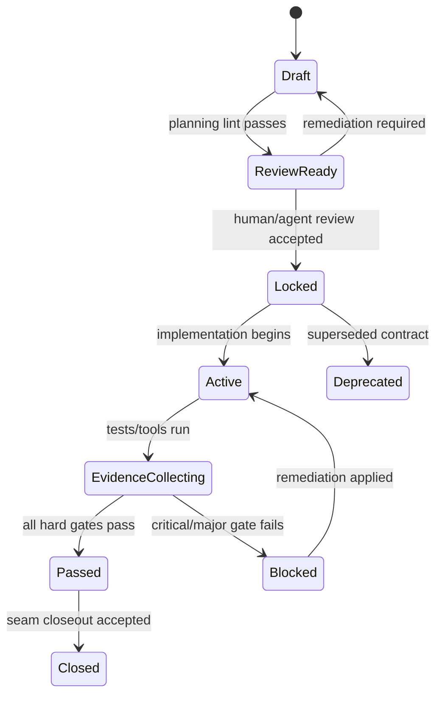
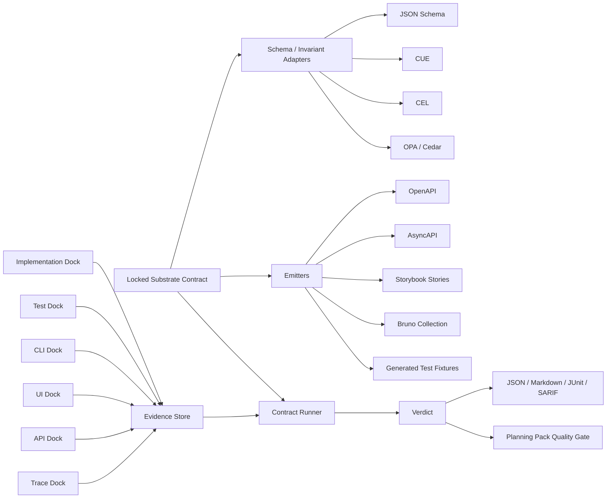

# Substrate Executable Contracts Architecture

**Draft:** v0.1  
**Date:** 2026-05-22  
**Context:** Substrate planning/spec development, autonomous coding gates, contract shim / contract membrane

---

## 0. Executive recommendation

Build a **Substrate-native executable contract layer** that treats a reviewed planning/spec contract as the source of truth, then lets implementation code, tests, generated docs, API clients, traces, and tool output **dock** against that contract.

Do **not** build a new universal validator from scratch. Build the orchestration layer that unifies existing contract ecosystems.

The winning shape is:

```text
reviewed/locked Substrate Contract
  -> schema/invariant/doc/test adapters
  -> implementation evidence
  -> test evidence
  -> report/verdict/gate
  -> planning pack seam closeout decision
```

Substrate should own:

- Contract identity, lifecycle, review state, and versioning.
- Claim/invariant registry.
- Evidence model.
- Dock/adaptor protocol.
- Severity, scoring, and hard gate semantics.
- Reports: JSON, Markdown, JUnit, SARIF, JSONL trace evidence.
- Planning-pack integration.
- Agent-readable remediation output.

Existing OSS should own:

- JSON data validation.
- Rich constraints / policy evaluation.
- OpenAPI / AsyncAPI / GraphQL / Protobuf validation.
- API mocks/proxies/fuzzers/docs/client collections.
- UI component render/interaction/a11y/visual validation.
- DB migration/schema drift checks.
- Model checking / state-machine validation where needed.

### Core principle

Tests are not the source of truth. Code is not the source of truth. Generated docs are not the source of truth.

The **locked contract** is the source of truth. Tests, implementation, docs, and traces are witnesses.

---

## 1. Problem statement

Substrate needs a way to make autonomous coding safer and more deterministic. Planning packs can define what should be built, but once agents begin implementation, the system needs a machine-checkable way to answer:

1. Did the code implement the reviewed contract?
2. Do the tests actually cover the reviewed contract?
3. Did generated API docs drift from the reviewed contract?
4. Did the implementation preserve required behavior, side effects, permissions, and failure modes?
5. Can the seam close, or is it blocked?

A normal unit test suite answers only a narrow version of this. It usually says “the current test assertions passed.” It does not necessarily prove that the implementation, docs, tests, traces, and expected side effects all match the same reviewed spec.

The proposed contract shim/membrane solves that by creating a single executable contract artifact that multiple surfaces can dock into.

---

## 2. Vocabulary

### Contract

A machine-readable, reviewed artifact that describes a boundary, operation, component, workflow, or behavior.

Examples:

- `operation: lift.score.calculate.v1`
- `cli: substrate.contract.run.v1`
- `http: worlds.create.v1`
- `component: ui.world_card.v1`
- `workflow: planning_pack.seam_closeout.v1`
- `policy: world.egress.v1`

### Claim

An individual assertion inside a contract.

Examples:

- Input must match schema.
- Output must contain `score` between `0.0` and `1.0`.
- Command must not write outside allowed workspace.
- UI component must expose an accessible role/name.
- API response must not remove a previously documented required field.
- State transition from `draft` to `locked` requires review evidence.

### Dock

An adapter that allows a surface to submit evidence against a contract.

Dock types:

- Implementation dock.
- Test dock.
- Trace dock.
- API docs dock.
- CLI dock.
- UI dock.
- DB dock.
- Policy dock.
- Agent-output dock.

### Evidence

Observed facts produced by code, tests, tool runs, traces, docs generation, or snapshots.

Examples:

- A function input/output pair.
- A CLI stdout/stderr/exit-code record.
- A filesystem write set.
- An HTTP request/response transcript.
- A Storybook state and Playwright trace.
- A DB migration plan.
- A policy decision log.

### Verdict

The result of evaluating evidence against claims.

Examples:

- `pass`
- `fail`
- `blocked`
- `warning`
- `not_observed`
- `not_applicable`
- `flaky`

### Gate

A quality gate decision that can block a seam, merge, release, or agent handoff.

Important rule: **a 7/10 score is not green.** Scores are useful for progress and agent steering. Critical claim failures should hard-block regardless of aggregate score.

---

## 3. Contract lifecycle



Recommended states:

| State | Meaning |
|---|---|
| `draft` | Contract is still being authored. It can move. |
| `review_ready` | Contract is linted and complete enough for review. |
| `locked` | Contract is the authoritative spec for execution. |
| `active` | Implementation/test work is being evaluated against it. |
| `passed` | Evidence satisfies the gate. |
| `blocked` | Evidence violates a required claim. |
| `closed` | Seam or slice has been accepted. |
| `deprecated` | Contract exists for history but should not be used for new work. |

---

## 4. Contract taxonomy

Substrate likely needs a family of contract types rather than one mega-format.

### 4.1 Data shape contracts

**Purpose:** Validate data structure, required fields, enum values, primitive types, ranges, nullable fields, arrays, maps, and nested objects.

**Used for:**

- Function input/output.
- CLI JSON input/output.
- API request/response bodies.
- Event payloads.
- Planning-pack metadata.
- Contract evidence records.

**Primary formats/tools:**

| Tool/spec | License posture | Role |
|---|---:|---|
| JSON Schema | Spec, permissive ecosystem | Default schema language for JSON-like data. |
| `jsonschema` Rust crate | MIT | Runtime validation in Rust. |
| `schemars` Rust crate | MIT | Generate JSON Schema from Rust types. |
| CUE | Apache-2.0 | Richer data constraints, unification, and config/data validation. |

**Substrate stance:** Use JSON Schema as the default portable shape layer. Add CUE where cross-field constraints or richer composition are needed.

---

### 4.2 Business-rule / invariant contracts

**Purpose:** Validate domain rules that are more expressive than basic shape validation.

Examples:

- `score >= 0 && score <= 1`
- `discount_total <= subtotal`
- `locked_at` must exist when `state == locked`
- If `egress == denied`, no network trace may exist.
- A seam cannot close if any critical claim is unresolved.

**Primary tools:**

| Tool/spec | License posture | Role |
|---|---:|---|
| CUE | Apache-2.0 | Data constraints, cross-field validation, unification. |
| CEL | Apache-2.0 ecosystem | Lightweight embeddable expression language. |
| OPA/Rego | Apache-2.0 | General policy engine. Better for governance/policy. |
| Cedar | Apache-2.0 | Fine-grained authorization/policy language. |

**Substrate stance:**

- Use **CUE** for data-heavy invariants and contract composition.
- Use **CEL** for small embedded boolean expressions if Rust embedding is clean.
- Use **OPA/Cedar** for policy/security/authorization contracts rather than normal business logic.

---

### 4.3 Internal operation contracts

**Purpose:** Validate non-API internal logic: pure functions, services, crate boundaries, algorithms, planners, transforms, scoring functions, and state reducers.

**Used for:**

- `lift` scoring operations.
- Worktree orchestration planners.
- Contract scoring itself.
- Planning-pack lint rules.
- Config resolution.
- Internal model/context transforms.

**Tooling:**

| Tool | License posture | Role |
|---|---:|---|
| JSON Schema + CUE/CEL | MIT/Apache ecosystem | Input/output shape and invariants. |
| `proptest` | MIT/Apache-style Rust ecosystem | Property-based testing. |
| `insta` | Apache-2.0 | Snapshot regression testing. |
| `mockall` | MIT/Apache | Mock trait/struct behavior for unit tests. |
| `wiremock-rs` | MIT/Apache | Mock HTTP dependencies. |

**Substrate-specific addition:** Define a `ContractDock` trait and evidence emitter for Rust operations.

```rust
pub trait ContractDock {
    fn contract_id(&self) -> ContractId;
    fn observe(&self, case: ContractCase) -> anyhow::Result<ContractEvidence>;
}
```

---

### 4.4 CLI command contracts

**Purpose:** Validate command-line tools as stable agent-operable interfaces.

This is extremely important for Substrate because agents will operate the system through CLI surfaces and JSON output.

**Claims:**

- Exit code semantics.
- Required stdout/stderr shape.
- `--json` response envelope.
- Error code taxonomy.
- No accidental human-only output in JSON mode.
- File effects.
- Determinism.
- Streaming/event envelope order.

**Tooling:**

| Tool | License posture | Role |
|---|---:|---|
| `assert_cmd` | MIT/Apache | Command invocation assertions. |
| `snapbox` | MIT/Apache | Snapshot testing for CLI stdout/stderr/filesystem effects. |
| `trycmd` | MIT/Apache | File-based CLI command test fixtures. |
| `assert_fs` | MIT/Apache | Temp filesystem setup and assertions. |
| `insta` | Apache-2.0 | Snapshot outputs and structured values. |

**Substrate stance:** CLI contracts are first-class. Every command that agents call should eventually have a contract.

---

### 4.5 HTTP API contracts

**Purpose:** Validate HTTP endpoints and generate docs, clients, mocks, and tests.

**Primary spec:** OpenAPI.

**Tooling:**

| Tool/spec | License posture | Role |
|---|---:|---|
| OpenAPI Specification | Permissive standard ecosystem | Machine-readable HTTP API description. |
| `utoipa` | MIT/Apache-style Rust ecosystem | Rust code-first OpenAPI generation. |
| `aide` | MIT/Apache | Rust code-first API docs, OpenAPI 3.1. |
| Specmatic | MIT | Contract-as-tests, service virtualization, dynamic tests. |
| Schemathesis | MIT | Property-based/fuzz testing from OpenAPI/GraphQL. |
| Prism | Apache-2.0 | Mock server and validation proxy from OpenAPI/Postman. |
| Spectral | Apache-2.0 | JSON/YAML/OpenAPI/AsyncAPI linting. |
| oasdiff | Apache-2.0 | OpenAPI diff and breaking-change detection. |
| OpenAPI Generator | Apache-2.0 | Client/server code generation. |
| Swagger UI | Apache-2.0 | Interactive OpenAPI docs. |
| Redoc | MIT | OpenAPI docs UI. |
| Scalar | MIT | OpenAPI docs/client platform; can be self-hosted. |
| Bruno | MIT | Git-native/local-first API client collections. |

**Substrate stance:** Use OpenAPI as an adapter target, not the single source of truth. The locked Substrate contract should be able to emit OpenAPI or verify code-generated OpenAPI for drift.

---

### 4.6 Event/message contracts

**Purpose:** Validate message-driven systems: events, queues, streams, webhooks, pub/sub, Kafka-like topics, etc.

**Primary spec:** AsyncAPI.

**Tooling:**

| Tool/spec | License posture | Role |
|---|---:|---|
| AsyncAPI | Apache-2.0 spec repo | Message-driven API contract. |
| Specmatic | MIT | Supports AsyncAPI contract testing/service virtualization. |
| Pact | MIT | Consumer-driven contracts; supports HTTP and event-driven/message interactions. |
| JSON Schema / CUE | MIT/Apache ecosystem | Event payload shape and invariants. |

**Substrate stance:** AsyncAPI is the event equivalent of OpenAPI. Use it for inter-service/event boundaries, but keep Substrate Contract above it.

---

### 4.7 GraphQL contracts

**Purpose:** Validate GraphQL APIs, schema drift, query/operation compatibility, generated types, and behavior.

**Tooling:**

| Tool/spec | License posture | Role |
|---|---:|---|
| GraphQL Specification | Spec under OWFa; source code often MIT | GraphQL language/execution contract. |
| GraphQL SDL / introspection | Ecosystem standard | Schema contract. |
| `graphql-js` | MIT | Reference JS implementation. |
| GraphQL Code Generator | MIT | Generate types/code from schemas and operations. |
| Schemathesis | MIT | GraphQL property-based API tests. |
| Specmatic | MIT | GraphQL SDL contract support. |

**Substrate stance:** Treat GraphQL SDL/introspection as a contract adapter. Keep operation-level examples and invariants in Substrate Contract.

---

### 4.8 gRPC / Protobuf contracts

**Purpose:** Validate protobuf/gRPC service schemas, compatibility, and generated clients/servers.

**Tooling:**

| Tool/spec | License posture | Role |
|---|---:|---|
| Protocol Buffers / gRPC | Permissive ecosystem | RPC/message schema and service interface. |
| Buf | Apache-2.0 ecosystem | Linting and breaking-change detection for protobuf schemas. |
| Specmatic | MIT | gRPC/proto contract support. |
| Smithy | Apache-2.0 | Protocol-agnostic IDL for services and shapes. |
| TypeSpec | MIT | Higher-level API/service modeling; can emit OpenAPI and other artifacts. |

**Substrate stance:** Add this later if/when Substrate owns gRPC/protobuf service boundaries. Buf is likely the first tool to add.

---

### 4.9 Database/schema/migration contracts

**Purpose:** Validate database schemas, migrations, query compatibility, and drift.

**Claims:**

- Migration applies cleanly.
- Migration is reversible, if required.
- Query compiles against schema.
- No destructive change without contract flag.
- Index/constraint exists.
- Drift from desired schema is reported.

**Tooling:**

| Tool | License posture | Role |
|---|---:|---|
| Atlas Community Edition | Apache-2.0 | Database schema management, migrations, drift detection style workflows. |
| SQLx | MIT/Apache | Compile-time checked SQL queries in Rust. |
| SeaORM | MIT/Apache | Rust ORM with entity/schema layer. |
| Liquibase 5+ | Caution: FSL then Apache after time delay | Powerful migration tool, but less aligned with preferred license posture. |

**Substrate stance:** Prefer Atlas + SQLx for a Rust-native/permissive posture. Avoid embedding Liquibase 5+ into distributable Substrate packages unless license review says it is acceptable.

---

### 4.10 UI component contracts

**Purpose:** Validate frontend components outside HTTP APIs: props, states, interactions, accessibility, visual regressions, and docs.

**Contract surfaces:**

- Props schema.
- Required states.
- Interaction scenarios.
- Accessibility claims.
- Visual snapshot claims.
- Design token usage.
- Storybook documentation.

**Tooling:**

| Tool/spec | License posture | Role |
|---|---:|---|
| Storybook / CSF | MIT | Component states, docs, interaction scenarios. |
| Playwright | Apache-2.0 | Browser/runtime interaction tests and screenshots. |
| Testing Library | MIT | User-oriented DOM assertions. |
| axe-core | MPL-2.0 | Accessibility rule engine; useful but license-caution. |
| Pa11y | LGPL-3.0 | Accessibility testing; stronger license caution. |
| Style Dictionary | Apache-2.0 | Transform design tokens to platform outputs. |
| DTCG Design Tokens format | Standard | Design token contract shape. |

**Substrate stance:** Storybook is the closest “OpenAPI-like” UI state/documentation layer, but it is not the authority. Substrate Contract should define the required component states/interactions and then emit/validate Storybook stories plus Playwright/Testing Library/a11y evidence.

---

### 4.11 UI flow / E2E contracts

**Purpose:** Validate multi-step user flows in browser or desktop app contexts.

**Examples:**

- Create a new world in Collider.
- Run a command block.
- View timeline event details.
- Review a contract failure report.
- Execute a planning-pack seam gate.

**Tooling:**

| Tool | License posture | Role |
|---|---:|---|
| Playwright | Apache-2.0 | Browser E2E and component testing. |
| Testing Library | MIT | DOM assertions that mirror user behavior. |
| Storybook play functions | MIT | Component-level interaction scenarios. |
| axe-core | MPL-2.0 | Accessibility checks. |

**Substrate stance:** Keep flow contracts as structured scenarios with stable selectors, user-visible assertions, a11y claims, and trace evidence.

---

### 4.12 Design-token contracts

**Purpose:** Validate visual/design system consistency across UI surfaces.

**Claims:**

- Token exists.
- Token type is correct.
- Token references resolve.
- Component uses allowed tokens.
- Exported CSS/JS/mobile token artifacts match source tokens.

**Tooling:**

| Tool/spec | License posture | Role |
|---|---:|---|
| Design Tokens Community Group format | Standard | Cross-tool design-token schema. |
| Style Dictionary | Apache-2.0 | Token transforms to CSS, JS, Android, iOS, docs, etc. |

**Substrate stance:** Use DTCG-style tokens as the shape, Style Dictionary as a generator/validator, and Substrate Contract as the gate tying tokens to UI components.

---

### 4.13 Policy/security/contracts

**Purpose:** Validate authorization, egress, sandbox, filesystem, tool access, and safety policies.

**Claims:**

- Tool is allowed/denied under context.
- World egress obeys policy.
- Filesystem write stays within allowed mounts.
- Orchestration agent can access orchestration-only tools.
- Execution agent cannot access planning-only tools.
- Contract runner emits a policy decision trace.

**Tooling:**

| Tool/spec | License posture | Role |
|---|---:|---|
| OPA/Rego | Apache-2.0 | General policy decisions. |
| Cedar | Apache-2.0 | Authorization policies with entities/actions/resources. |
| CEL | Apache-2.0 ecosystem | Lightweight embedded policy/boolean expressions. |

**Substrate stance:** Policy contracts should be first-class because Substrate’s sandbox/policy identity is core. Keep policy evaluation evidence separate from business-logic evidence.

---

### 4.14 Stateful workflow / model contracts

**Purpose:** Validate state machines and workflows where simple example tests are insufficient.

**Examples:**

- Planning-pack lifecycle.
- Contract lifecycle.
- Orchestration/session lifecycle.
- Multi-agent workstream planner.
- World lifecycle.
- Lease/lock/concurrency behavior.

**Tooling:**

| Tool | License posture | Role |
|---|---:|---|
| TLA+ tools / TLC | MIT | Formal specs and model checking. |
| Apalache | Apache-style ecosystem? verify exact version before vendoring | Symbolic model checker for TLA+. |
| Stateright | MIT | Rust model checker for distributed/stateful systems. |
| Kani Rust Verifier | MIT/Apache | Rust model checking for safety/correctness properties. |
| Modelator | Apache-2.0 | Generate tests from TLA+ models via Apalache. |

**Substrate stance:** Do not make this part of MVP. Add as an advanced contract class for concurrency/state-heavy seams.

---

### 4.15 Filesystem/side-effect contracts

**Purpose:** Validate effects beyond return values.

**Claims:**

- Files created/modified/deleted exactly match expected set.
- No writes outside sandbox/world/worktree.
- No network access occurred.
- Process spawn behavior matches allowed set.
- Logs/traces contain required events.

**Tooling:**

| Tool | License posture | Role |
|---|---:|---|
| `assert_fs` | MIT/Apache | Test filesystem fixtures and assertions. |
| `snapbox` | MIT/Apache | Snapshot filesystem/stdout/stderr behavior. |
| Substrate trace/evidence collector | Substrate-owned | World/process/file/network evidence. |

**Substrate stance:** This is one of the places where Substrate should be better than generic contract tools because it already cares about sandboxing, tracing, and world policy.

---

### 4.16 Performance/resource contracts

**Purpose:** Validate that implementation remains within operational bounds.

**Claims:**

- Command completes under threshold.
- Memory stays under threshold.
- Number of files scanned is bounded.
- Search/planner returns within budget.
- Contract runner does not materially slow normal dev/test loops.

**Tooling:**

| Tool | License posture | Role |
|---|---:|---|
| Criterion.rs | MIT/Apache | Rust benchmarking. |
| Hyperfine | MIT/Apache-style ecosystem | CLI benchmarking. |
| Substrate trace collector | Substrate-owned | Resource usage evidence. |

**Substrate stance:** Start with advisory warnings, not hard gates, except for explicitly critical paths.

---

### 4.17 Supply-chain/license contracts

**Purpose:** Enforce dependency, license, SBOM, and vulnerability expectations.

**Claims:**

- Dependencies use allowed licenses.
- SBOM generated.
- Known vulnerabilities below threshold.
- No GPL/AGPL/LGPL/FSL/SSPL/BSL dependencies in packaged crates unless explicitly allowed.
- License notices included.

**Tooling:**

| Tool | License posture | Role |
|---|---:|---|
| cargo-deny | MIT/Apache | Rust dependency license/advisory/source checks. |
| cargo-about | MIT/Apache | Generate dependency license listing. |
| cargo-cyclonedx | Apache-2.0 | Generate CycloneDX SBOM for Rust projects. |
| OSV-Scanner | Apache-2.0 | Vulnerability scanning. |

**Substrate stance:** Add these as repo-level governance gates early. This is especially important because the project wants permissive wrapping/packaging.

---

## 5. Recommended contract model

### 5.1 Contract file

Recommended source format: YAML or TOML for human-edited contracts, normalized into canonical JSON for machine evaluation.

```yaml
schema: substrate.contract/v0.1
id: lift.score.calculate.v1
kind: operation
status: locked

subject:
  crate: lift
  symbol: lift::score::calculate
  seam: seam_003

lifecycle:
  locked_by: review.gate.contract.v1
  locked_at: 2026-05-22T00:00:00Z

inputs:
  schema:
    engine: jsonschema
    path: ./schemas/lift_score_input.schema.json

outputs:
  schema:
    engine: jsonschema
    path: ./schemas/lift_score_output.schema.json

claims:
  - id: input_shape_valid
    kind: schema
    severity: critical
    engine: jsonschema
    target: input

  - id: score_is_bounded
    kind: invariant
    severity: critical
    engine: cue
    expression: "score >= 0 && score <= 1"
    target: output

  - id: deterministic_same_input
    kind: behavior
    severity: critical
    evidence_required: true

  - id: no_filesystem_write
    kind: side_effect
    severity: major
    evidence_required: true

examples:
  positive:
    - id: simple_valid_case
      input: ./fixtures/simple.input.json
      expected_output: ./fixtures/simple.output.json

  negative:
    - id: missing_required_field
      input: ./fixtures/missing_required_field.input.json
      expected_error: InvalidInput

coverage:
  required_claims:
    - input_shape_valid
    - score_is_bounded
    - deterministic_same_input
    - no_filesystem_write

scoring:
  min_weighted_score: 0.95
  hard_fail_severities:
    - critical
  treat_not_observed_as: fail_for_required

emits:
  reports:
    - json
    - markdown
    - junit
    - sarif
```

### 5.2 Evidence file

```json
{
  "schema": "substrate.contract.evidence/v0.1",
  "contract_id": "lift.score.calculate.v1",
  "producer": {
    "kind": "implementation",
    "crate": "lift",
    "target": "lift::score::calculate"
  },
  "case_id": "simple_valid_case",
  "observed": {
    "input_ref": "./fixtures/simple.input.json",
    "output": {
      "score": 0.82,
      "reasons": ["high coupling", "low churn"]
    },
    "error": null,
    "exit_code": null
  },
  "side_effects": {
    "files_written": [],
    "network": [],
    "processes_spawned": []
  },
  "trace_ref": "./target/contract-evidence/traces/simple_valid_case.jsonl"
}
```

### 5.3 Test coverage evidence

```json
{
  "schema": "substrate.contract.test_coverage/v0.1",
  "contract_id": "lift.score.calculate.v1",
  "producer": {
    "kind": "test_suite",
    "test_binary": "lift_contract_tests"
  },
  "claims_covered": [
    "input_shape_valid",
    "score_is_bounded",
    "deterministic_same_input"
  ],
  "claims_not_observed": [
    "no_filesystem_write"
  ],
  "test_cases": [
    {
      "test_id": "score_simple_valid_case",
      "case_id": "simple_valid_case",
      "evidence_ref": "./target/contract-evidence/simple_valid_case.json"
    }
  ]
}
```

### 5.4 Verdict file

```json
{
  "schema": "substrate.contract.verdict/v0.1",
  "contract_id": "lift.score.calculate.v1",
  "status": "blocked",
  "score": 0.74,
  "gate": {
    "decision": "block",
    "reason": "critical claim failed"
  },
  "summary": {
    "claims_total": 10,
    "claims_passed": 7,
    "claims_failed": 2,
    "claims_not_observed": 1,
    "critical_failures": 1
  },
  "failures": [
    {
      "claim_id": "score_is_bounded",
      "severity": "critical",
      "expected": "score <= 1",
      "observed": "score == 1.2",
      "remediation_hint": "Clamp score output or fix normalization in lift::score::calculate."
    }
  ]
}
```

---

## 6. Dock architecture



---

## 7. Possible architecture shapes

### Option A — Substrate meta-contract + adapters

**Summary:** Substrate owns the contract/evidence/verdict/gate model. Existing tools are adapters.

```text
substrate-contract-core
substrate-contract-runner
substrate-contract-jsonschema
substrate-contract-cue
substrate-contract-openapi
substrate-contract-ui
substrate-contract-policy
```

**Pros:**

- Best fit for Substrate’s planning-pack and autonomous-coding use case.
- Avoids reinventing mature validators.
- Keeps OpenAPI as one adapter, not the center of the system.
- Supports internal logic, CLI, UI, policy, and side effects.
- Lets Substrate score both implementation and test coverage.

**Cons:**

- More architecture to define up front.
- Needs careful schema/version governance.
- Adapter maintenance burden.

**Recommendation:** Preferred.

---

### Option B — IDL-first using TypeSpec or Smithy

**Summary:** Use TypeSpec or Smithy as the main spec language and emit OpenAPI/other artifacts.

**Pros:**

- Mature service modeling concepts.
- Strong API/doc/codegen pathway.
- Better for service interfaces than raw YAML.

**Cons:**

- Too API/service-shaped for many Substrate contracts.
- Internal logic, CLI side effects, UI states, planning gates, and test coverage still need custom layers.
- Could turn the project into an IDL-first system prematurely.

**Recommendation:** Keep as optional adapter/inspiration, not core v0.

---

### Option C — Test-evidence-first

**Summary:** Keep contracts lightweight and focus on collecting evidence from tests, snapshots, traces, and fixtures.

**Pros:**

- Fastest MVP.
- Low conceptual overhead.
- Good for CLI/internal operations.

**Cons:**

- Easier for tests to become the hidden source of truth.
- Weaker docs/API generation path.
- Harder to prevent spec drift.

**Recommendation:** Good MVP strategy only if contracts still remain authoritative.

---

### Option D — OpenAPI/docs-first

**Summary:** Generate OpenAPI/Swagger/Scalar/Redoc from code and treat docs as the source.

**Pros:**

- Familiar.
- Easy demo value.
- Works for HTTP APIs.

**Cons:**

- Wrong center for Substrate.
- Code-first generation can silently move the contract when agents change code.
- Does not cover internal logic, CLI, UI, policy, DB, or side effects well.

**Recommendation:** Do not use as the architectural center.

---

## 8. Recommended crate/package layout

```text
crates/
  substrate-contract-core/
    src/
      contract.rs
      claim.rs
      evidence.rs
      verdict.rs
      scoring.rs
      severity.rs
      lifecycle.rs
      report.rs

  substrate-contract-runner/
    src/
      cli.rs
      run.rs
      collect.rs
      evaluate.rs
      emit.rs

  substrate-contract-jsonschema/
    src/
      validate.rs
      compile.rs
      report.rs

  substrate-contract-cue/
    src/
      adapter.rs
      cue_cmd.rs
      cue_report.rs

  substrate-contract-cel/
    src/
      eval.rs
      env.rs

  substrate-contract-policy/
    src/
      opa.rs
      cedar.rs
      decision_log.rs

  substrate-contract-openapi/
    src/
      emit.rs
      diff.rs
      lint.rs
      docs.rs

  substrate-contract-asyncapi/
    src/
      emit.rs
      validate.rs

  substrate-contract-rust/
    src/
      dock.rs
      derive.rs
      test_helpers.rs
      evidence_macros.rs

  substrate-contract-cli/
    src/
      assert_cmd_adapter.rs
      snapbox_adapter.rs
      trycmd_adapter.rs

  substrate-contract-ui/
    src/
      storybook.rs
      playwright.rs
      a11y.rs
      visual.rs

  substrate-contract-db/
    src/
      atlas.rs
      sqlx.rs
      migration_contract.rs

  substrate-contract-supply-chain/
    src/
      cargo_deny.rs
      sbom.rs
      osv.rs

  substrate-contract-reports/
    src/
      markdown.rs
      junit.rs
      sarif.rs
      json.rs
```

Alternative package naming if you want this under a broader agent/tooling umbrella:

```text
crates/substrate-agent-contract-core
crates/substrate-agent-contract-runner
crates/substrate-agent-contract-ui
```

But I would keep the shorter `substrate-contract-*` naming unless this becomes explicitly bundled under a `substrate-agent` SDK.

---

## 9. Planning-pack integration

Recommended pack layout:

```text
docs/project_management/packs/active/<feature>/
  contract.md
  decision_register.md
  contracts/
    lift.score.calculate.v1.contract.yaml
    lift.score.calculate.v1.schema.input.json
    lift.score.calculate.v1.schema.output.json
    fixtures/
      simple.input.json
      simple.output.json
      missing_required_field.input.json
  evidence/
    .gitkeep
  reports/
    .gitkeep
  tasks.json
```

During execution:

```text
cargo substrate-contract run \
  --contract docs/project_management/packs/active/<feature>/contracts/lift.score.calculate.v1.contract.yaml \
  --evidence target/contract-evidence/ \
  --emit json,markdown,junit,sarif \
  --gate seam-closeout
```

Gate output should be agent-readable:

```text
Gate: BLOCKED
Reason: critical claim failed
Failed claim: score_is_bounded
Expected: score <= 1
Observed: score == 1.2
Next: Fix lift::score::calculate normalization and rerun contract gate.
```

---

## 10. Scoring and gate model

### Severity levels

| Severity | Meaning | Gate behavior |
|---|---|---|
| `critical` | Must pass for seam closure. | Hard block. |
| `major` | Important correctness/coverage claim. | Usually block unless explicitly waived. |
| `minor` | Useful but not release-critical. | Warning or score reduction. |
| `advisory` | Informational quality signal. | No block. |

### Verdict types

| Verdict | Meaning |
|---|---|
| `pass` | Claim satisfied. |
| `fail` | Claim observed and violated. |
| `not_observed` | Required evidence missing. |
| `not_applicable` | Claim does not apply to this run/context. |
| `flaky` | Evidence inconsistent across repeated runs. |
| `waived` | Human/authorized policy waived claim with reason. |

### Scoring rule

Use weighted scoring for agent feedback, not as the only merge decision.

Recommended:

```text
final_gate = block if any critical claim fails
final_gate = block if required evidence is missing
final_gate = block if weighted_score < min_weighted_score
otherwise pass
```

---

## 11. MVP roadmap

### MVP 0 — Core contract runner

Build:

- `substrate-contract-core`
- `substrate-contract-runner`
- JSON Schema validation adapter.
- Contract/evidence/verdict JSON schemas.
- Markdown + JSON report.
- JUnit output for CI.
- Hard severity gate model.

Support contracts:

- Internal operation contracts.
- CLI command contracts.
- Data shape contracts.

Defer:

- UI, OpenAPI, AsyncAPI, DB, policy, state-model adapters.

### MVP 1 — Rust + CLI docking

Add:

- Rust `ContractDock` trait.
- Test helper macros.
- `assert_cmd`/`snapbox`/`trycmd` bridge.
- Filesystem side-effect evidence.
- `cargo test` integration.

### MVP 2 — HTTP/API adapter

Add:

- OpenAPI emitter/drift checker.
- Spectral/oasdiff wrappers.
- Schemathesis runner wrapper.
- Prism mock/proxy integration.
- Swagger UI/Redoc/Scalar static docs output.
- Bruno collection emitter.

### MVP 3 — UI/design adapter

Add:

- Component contract kind.
- Storybook CSF emitter/verifier.
- Playwright component/flow evidence.
- Testing Library assertion mapping.
- axe-core external runner or optional integration.
- Design token contract with Style Dictionary.

### MVP 4 — Policy/DB/state contracts

Add:

- OPA/Cedar/CEL adapters.
- Atlas/SQLx database contract checks.
- Stateright/Kani/TLA+ optional advanced adapters.
- SBOM/license/vulnerability gates.

---

## 12. Tooling matrix summary

| Contract family | Primary spec/shape | Preferred tools | License posture | Substrate role |
|---|---|---|---:|---|
| Data shape | JSON Schema | `jsonschema`, `schemars` | MIT | Validate inputs/outputs/evidence. |
| Rich data constraints | CUE | CUE CLI/libs | Apache-2.0 | Cross-field invariants and composition. |
| Small expressions | CEL | CEL implementations | Apache-2.0 ecosystem | Embedded claim expressions. |
| Policy/security | Rego/Cedar/CEL | OPA, Cedar | Apache-2.0 | Sandbox/tool/egress/authz policy evidence. |
| Internal logic | Contract + examples/properties | proptest, insta, mockall | MIT/Apache | Validate crate operations. |
| CLI | Contract + snapshots | assert_cmd, snapbox, trycmd, assert_fs | MIT/Apache | Validate agent-operable CLI behavior. |
| HTTP API | OpenAPI | Specmatic, Schemathesis, Prism, Spectral, oasdiff | Mostly MIT/Apache | Docs, mocks, fuzz, drift, tests. |
| API docs/client | OpenAPI | Scalar, Redoc, Swagger UI, Bruno | MIT/Apache | Human docs and local-first API exploration. |
| Events | AsyncAPI | AsyncAPI, Specmatic, Pact | Apache/MIT | Message contract validation. |
| GraphQL | SDL/introspection | GraphQL Codegen, Schemathesis, Specmatic | MIT | GraphQL schema/op validation. |
| gRPC/protobuf | `.proto` | Buf, Specmatic | Apache/MIT | Proto lint/breaking checks. |
| DB | Schema/migration | Atlas, SQLx | Apache/MIT | Migration/schema/query drift checks. |
| UI components | Storybook/CSF | Storybook, Playwright, Testing Library | MIT/Apache | Component state/interaction docs and tests. |
| Accessibility | WCAG rule evidence | axe-core | MPL-2.0 caution | A11y evidence; external/optional adapter first. |
| Design tokens | DTCG format | Style Dictionary | Apache-2.0 | Token validation and transforms. |
| State machines | TLA+/Rust model | TLA+, Stateright, Kani | MIT/Apache | Advanced workflow/concurrency proof. |
| Supply chain | License/SBOM | cargo-deny, cargo-about, cargo-cyclonedx, OSV | MIT/Apache | Dependency/license/vuln gates. |

---

## 13. License posture and packaging notes

The user preference is sensible: prefer **MIT**, **Apache-2.0**, or **MIT/Apache dual** so Substrate can wrap, alter, distribute, and package tooling without source-disclosure obligations.

Practical tiers:

### Tier 1 — Preferred

- MIT
- Apache-2.0
- MIT OR Apache-2.0
- BSD-2/BSD-3
- ISC

### Tier 2 — Acceptable with review

- MPL-2.0: file-level copyleft. Often workable, but be careful if modifying/vendoring.
- EPL: review required.
- CC0 / OWFa specs: fine for specs, but not necessarily source code.

### Tier 3 — Avoid embedding/vendoring by default

- GPL
- AGPL
- LGPL
- SSPL
- BSL
- FSL/time-delayed licenses

These may still be usable as optional external commands in some cases, but that should be treated as a deliberate architecture/licensing decision, not a casual dependency.

Recommended repo governance:

```text
cargo deny check licenses advisories bans sources
cargo about generate > THIRD_PARTY_LICENSES.html
cargo cyclonedx --format json --output-file sbom.json
osv-scanner --lockfile Cargo.lock
```

Not legal advice; this should become an engineering policy reviewed by counsel before commercial packaging.

---

## 14. Critical design decisions to noodle

### Decision 1 — Is Substrate Contract the source of truth?

Recommendation: yes.

OpenAPI, Storybook, generated tests, generated docs, and Rust code-derived schemas should be adapter outputs or drift-check inputs. They should not silently replace the reviewed planning contract.

### Decision 2 — YAML/TOML vs CUE as authoring format?

Recommendation:

- Start with YAML/TOML + JSON Schema for easier adoption.
- Allow CUE fragments for advanced constraints.
- Consider full CUE authoring later if composition pressure gets high.

### Decision 3 — How strict should test coverage docking be?

Recommendation:

Tests should be required to declare which claims they cover. The runner should fail required claims that are not observed by either implementation evidence or test evidence.

### Decision 4 — Should contracts emit tests or only validate tests?

Recommendation:

Both, but in phases:

1. Validate evidence from handwritten tests.
2. Generate fixtures/snapshots.
3. Generate property/fuzz/API tests.
4. Generate docs/client collections.

### Decision 5 — Do scores matter?

Recommendation:

Scores matter for agent steering and dashboards, but hard gates should remain severity-driven.

### Decision 6 — Is UI contract generation worth it?

Recommendation:

Yes, but not in MVP 0. UI contracts become extremely valuable for Collider and agent-built apps once the core evidence/verdict system works.

---

## 15. Immediate next implementation slice

A focused first seam could be:

```text
Seam 001: substrate-contract-core + JSON Schema operation/CLI contracts
```

Scope:

- Define `Contract`, `Claim`, `Evidence`, `Verdict`, `Severity`, `GateDecision` structs.
- Define canonical JSON schemas for contract/evidence/verdict.
- Add JSON Schema validation backend.
- Add CLI command:

```text
substrate contract validate --contract <path>
substrate contract run --contract <path> --evidence <dir> --emit json,markdown,junit
substrate contract explain --verdict <path>
```

Acceptance criteria:

1. A locked contract can validate its own schema.
2. Runner can ingest at least one implementation evidence file.
3. Runner can ingest at least one test coverage evidence file.
4. Runner emits JSON and Markdown reports.
5. Critical claim failure blocks the gate.
6. Missing required evidence blocks the gate.
7. Weighted score is computed but cannot override critical failure.
8. CI can consume JUnit output.

---

## 16. References checked during research

The following were reviewed for fit, role, and license posture. Verify exact versions/licenses before vendoring or packaging.

### Specs / schema / IDLs

- OpenAPI Specification: https://swagger.io/specification/
- OpenAPI Specification GitHub: https://github.com/OAI/OpenAPI-Specification
- AsyncAPI Specification: https://www.asyncapi.com/docs/reference/specification/v3.0.0
- AsyncAPI GitHub/license: https://github.com/asyncapi/spec
- JSON Schema: https://json-schema.org/specification
- CUE: https://cuelang.org/
- CUE docs: https://cuelang.org/docs/
- TypeSpec: https://typespec.io/
- TypeSpec GitHub/license: https://github.com/microsoft/typespec
- Smithy: https://smithy.io/

### API contract/test/docs tools

- Specmatic: https://github.com/specmatic/specmatic
- Schemathesis: https://github.com/schemathesis/schemathesis
- Prism: https://github.com/stoplightio/prism
- Pact: https://github.com/pact-foundation/pact-reference
- Spectral: https://github.com/stoplightio/spectral
- oasdiff: https://github.com/oasdiff/oasdiff
- OpenAPI Generator: https://github.com/OpenAPITools/openapi-generator
- Swagger UI: https://github.com/swagger-api/swagger-ui
- Redoc: https://github.com/Redocly/redoc
- Scalar: https://github.com/scalar/scalar
- Bruno: https://github.com/usebruno/bruno

### UI/design tools

- Storybook: https://storybook.js.org/
- Playwright: https://playwright.dev/
- Testing Library: https://testing-library.com/
- axe-core: https://github.com/dequelabs/axe-core
- Design Tokens Community Group: https://www.w3.org/community/design-tokens/
- Design Tokens format module: https://tr.designtokens.org/format/
- Style Dictionary: https://github.com/amzn/style-dictionary

### Rust/internal/CLI testing tools

- jsonschema: https://crates.io/crates/jsonschema
- schemars: https://crates.io/crates/schemars
- proptest: https://crates.io/crates/proptest
- insta: https://crates.io/crates/insta
- assert_cmd: https://crates.io/crates/assert_cmd
- snapbox: https://crates.io/crates/snapbox
- trycmd: https://crates.io/crates/trycmd
- assert_fs: https://crates.io/crates/assert_fs
- mockall: https://crates.io/crates/mockall
- wiremock: https://crates.io/crates/wiremock

### Policy / model checking / DB / supply chain

- OPA: https://www.openpolicyagent.org/
- Cedar: https://www.cedarpolicy.com/
- CEL: https://github.com/google/cel-spec
- TLA+ tools: https://github.com/tlaplus/tlaplus
- Apalache: https://apalache-mc.org/
- Stateright: https://github.com/stateright/stateright
- Kani: https://github.com/model-checking/kani
- Modelator: https://github.com/informalsystems/modelator
- Atlas: https://atlasgo.io/
- SQLx: https://github.com/launchbadge/sqlx
- SeaORM: https://github.com/SeaQL/sea-orm
- cargo-deny: https://github.com/EmbarkStudios/cargo-deny
- cargo-about: https://github.com/EmbarkStudios/cargo-about
- cargo-cyclonedx: https://github.com/CycloneDX/cyclonedx-rust-cargo
- OSV-Scanner: https://github.com/google/osv-scanner
