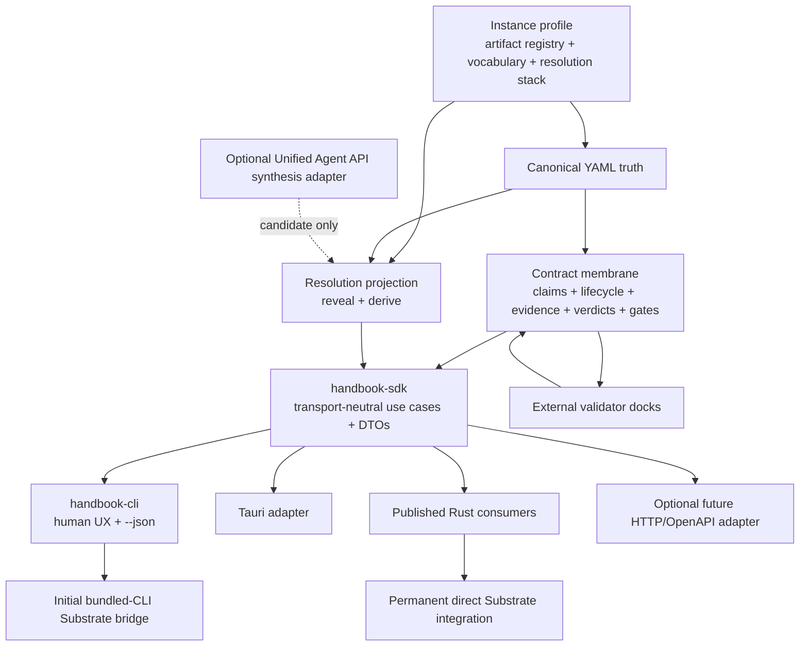

# Target Architecture

## Executive decision

Handbook will become a profile-driven, resolution-aware contract membrane with one transport-neutral capability layer:

> Canonical structured truth is interpreted through stable semantic roles, user-defined artifact and vocabulary profiles, explicit Context Resolution envelopes, deterministic projections, executable contracts, normalized evidence, and hard gate semantics.

The same non-CLI use cases must support:

- the polished `handbook` CLI;
- the future Tauri application;
- an initial bundled-CLI integration inside Substrate;
- the permanent direct Rust integration through published crates;
- future process and Rust-native docks;
- future workflow adapters and overlays.

## Target topology

## Authority split

### Handbook owns

- canonical structured artifact truth;
- stable semantic role identifiers;
- instance-profile validation and resolution;
- artifact registry and requiredness semantics;
- vocabulary and intentional conflation semantics;
- Context Resolution schemas and projection semantics;
- contract identity, lifecycle, claims, and invariants;
- dock protocol and capability negotiation;
- evidence normalization;
- verdict, scoring, hard-gate, and promotion semantics;
- transport-neutral request/result DTOs;
- schema identifiers and compatibility rules.

### The CLI owns

- command hierarchy and discoverability;
- help, examples, and polished operator language;
- argument parsing;
- human-readable rendering;
- `--json` selection and stdout/stderr discipline;
- process exit-code mapping;
- executable-shell concerns such as cwd/repo discovery.

The CLI must not own contract evaluation, artifact semantics, resolution projection, or dock normalization.

### `handbook-sdk` owns

`handbook-sdk` is the preferred name for the ordinary-consumer facade. The name communicates an embeddable library rather than a network daemon. Internal modules may use service/use-case terminology.

It should own:

- stable consumer-oriented use cases;
- request/result DTOs shared by CLI, Tauri, and ordinary Rust consumers;
- transport-neutral error/refusal types;
- capability and schema-version reporting;
- composition over the narrower owner crates.

Advanced consumers may still import owner crates directly. The SDK must expose capabilities, not internal module topology.

### Existing owner crates

The target should preserve the useful decoupling already present:

- `handbook-engine`: canonical data, schemas, profile/semantic validation, pure transformations;
- `handbook-flow`: request-scoped selection, context assembly, Resolution envelope application, packet/projection results;
- `handbook-pipeline`: declarative workflow compilation/capture/handoff and execution sequencing;
- `handbook-compiler`: current compatibility/support seam, not presumed to be the permanent facade;
- `handbook-cli`: executable transport only.

The final owner for contract-membrane primitives may be an existing owner crate or a purpose-named new crate. That decision belongs to the Phase 0 owner-boundary design slice; do not default it into `handbook-compiler` merely because that crate spans current shell concerns.

### Agent-facing Handbook skill

The primary agent workflow is skill-directed CLI use:

- the accompanying installed Handbook skill teaches an AI agent which repository facts to gather and which Handbook operations to invoke;
- the agent supplies structured inputs and requests through the supported CLI/SDK contract;
- Handbook performs deterministic parsing, validation, projection, contract evaluation, and writing;
- the skill must not recreate Handbook semantics in prompt prose or introduce an untracked nested model call;
- future skill instructions consume profile, capability, schema, and Resolution truth from Handbook rather than hard-coding one artifact/vocabulary set.

The skill is an onboarding/orchestration adapter. The CLI/SDK remains the executable product authority.

### Substrate owns

- Substrate-side orchestration and runtime behavior;
- when agents are dispatched;
- enforcement of tool, filesystem, process, and runtime authority;
- context collapse/expansion during execution;
- sequencing Handbook docks and gates in Substrate workflows;
- Substrate-facing product wording;
- optional model synthesis that belongs to Substrate's agent harness;
- replacement of the initial CLI bridge with published Rust consumption.

Substrate consumes Handbook contract meaning. It does not become a second contract authority.

## Integration ladder

### Tier 1 — Handbook product path

The CLI calls transport-neutral use cases and offers complete JSON output for every nontrivial operation.

### Tier 2 — Initial Substrate CLI bridge

Substrate may bundle and invoke an exact Handbook binary version and consume only its versioned JSON protocol.

This is a supported integration milestone. It is not proof that a downstream-intended Rust API is complete.

### Tier 3 — Tauri parity

The Tauri application invokes the same SDK use cases and Serde DTOs directly. It does not shell out to the CLI for normal operation.

### Tier 4 — Permanent Substrate Rust boundary

Substrate imports exact published Handbook crate versions from crates.io and uses them in a real seam. The proof must not rely on sibling paths or unpublished workspace internals.

## Canonical and projected artifacts

- YAML is the durable canonical representation where structure is semantically meaningful.
- Markdown, CLI text, GUI views, packets, OpenAPI, and external workflow formats are derived projections or adapter outputs.
- A derived view cannot silently become a second editable authority.
- Every projection identifies its source fingerprint, projection definition, target resolution, vocabulary profile, and lossiness.
- Expansion may reveal or deterministically derive existing truth. It may not invent canonical detail.

## Synthesis boundary

The initial projection engine is deterministic.

If Handbook later supports AI synthesis directly:

- it must use the `unified-agent-api` crates programmatically;
- it must be isolated from the canonical engine through an optional adapter/use case;
- it must emit provenance-bearing candidate output;
- it must never auto-promote synthesized content into canonical truth;
- review/lock gates must control promotion.

Substrate may instead remain the only synthesis owner. The core Handbook crates must not depend on an agent runtime for deterministic projection.

## Tauri and API posture

- Rust DTOs and JSON Schema are the primary transport-neutral contracts.
- Tauri commands are thin adapters around SDK use cases.
- OpenAPI is generated only when an HTTP boundary exists; it is not the canonical authority for CLI/Tauri payloads.
- Human CLI wording is not an API schema.
- Expected blocked/refused outcomes are structured results, not unparseable stderr prose.

## Dock posture

Handbook defines one semantic dock protocol.

- Process-based JSON docks are implemented first for isolation and language neutrality.
- Rust-native dock traits may follow without changing normalized evidence semantics.
- Docks declare capabilities and supported schema versions.
- Validators remain evidence producers/checkers, never contract authorities.
- A resolution-scoped dock result can prove only claims observed within its declared envelope.

## Non-negotiable invariants

1. **One contract authority** — Handbook owns contract meaning; consumers orchestrate it.
2. **Canonical structured truth** — no permanent Markdown/YAML dual authority.
3. **Stable semantics beneath custom language** — user vocabulary may rename or conflate roles without deleting machine meaning.
4. **Resolution is explicit** — context size alone is not a Resolution contract.
5. **Omission limits proof** — a projection cannot pass claims it did not expose or observe.
6. **Thin transports** — CLI, Tauri, HTTP, and Substrate adapters do not reimplement domain decisions.
7. **Greenfield directness** — no user migration framework or legacy compatibility tax.
8. **Typed JSON everywhere** — every nontrivial operation has a versioned machine contract.
9. **External validators remain witnesses** — docks do not become peer truth systems.
10. **Published means consumable** — downstream-intended Rust APIs are complete only after exact crates.io real-seam proof.
11. **CLI bridge is transitional by design** — it has an explicit replacement gate.
12. **Escalation is durable** — blocked or broadened work is recorded and re-dispatched; it is not carried only in chat history.

## Explicit non-goals

- dynamic CLI command renaming from vocabulary profiles;
- a universal validator reimplementation;
- arbitrary graph-shaped Resolution topology in the first version;
- model-generated canonical projections in the first version;
- a remote organization-profile registry in the first version;
- a third-party adapter marketplace in the first program;
- user migration tooling for legacy Handbook formats;
- preserving obsolete hard-coded behavior without a target-architecture reason.
