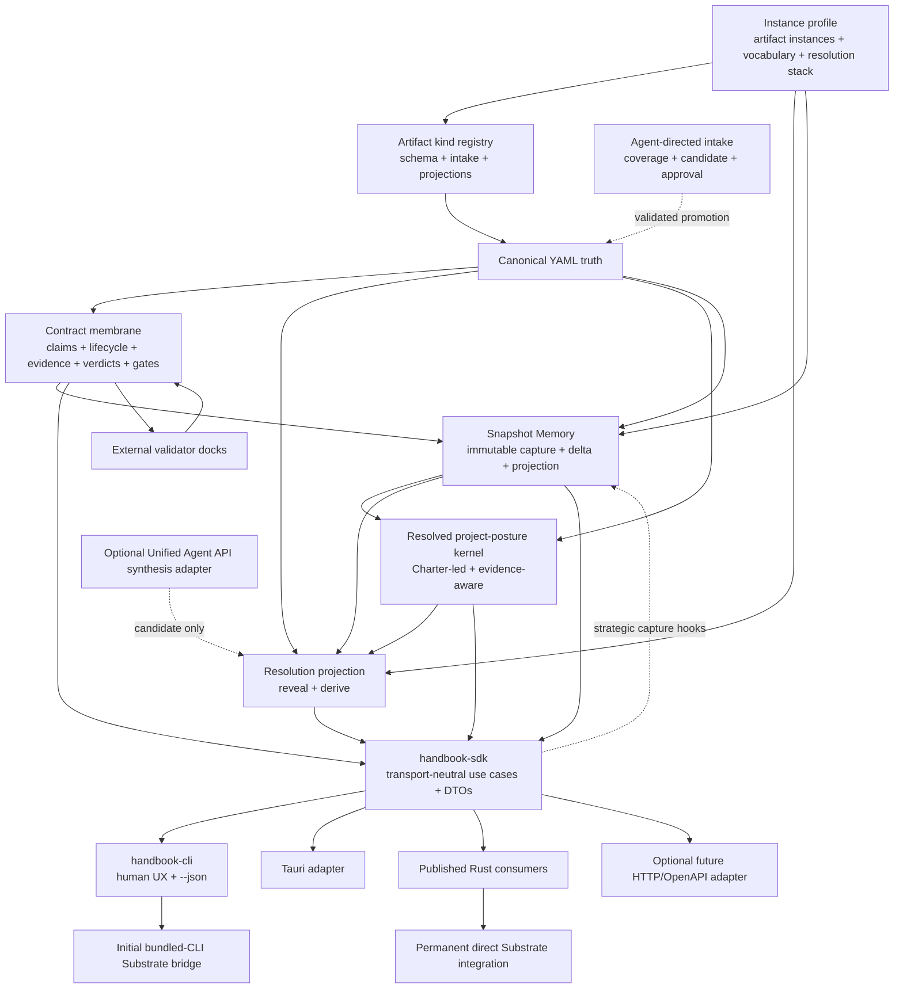

# Target Architecture

## Executive decision

Handbook will become a profile-driven, resolution-aware contract membrane with one transport-neutral capability layer:

> Canonical structured truth is interpreted through separate stable-role and semantic-capability registries, schema-defined artifact kinds, profile-selected artifact instances, agent-directed intake coverage, explicit Context Resolution envelopes, a Charter-led project-posture kernel, deterministic Snapshot Memory and projections, executable contracts, normalized evidence, and hard gate semantics.

The same non-CLI use cases must support:

- the polished `handbook` CLI;
- the future Tauri application;
- an initial bundled-CLI integration inside Substrate;
- the permanent direct Rust integration through published crates;
- future process and Rust-native docks;
- future workflow adapters and overlays.

## Target topology

## Authority split

### Handbook owns

- canonical structured artifact truth;
- a versioned replayable stable-role registry for typed places/workflow vocabulary and separate semantic-capability contracts for behavioral conformance;
- instance-profile validation and resolution;
- artifact-kind definitions, schema registry, artifact-instance descriptors, and requiredness semantics;
- intake coverage definitions, candidate validation, approval/promotion semantics, and deterministic Charter authoring boundaries;
- resolved project-posture semantics and typed recommendation/transition records without automatic canonical mutation;
- vocabulary and intentional conflation semantics;
- Context Resolution schemas and projection semantics;
- Snapshot Memory capture policy, immutable record, consistency, fingerprint, delta, drift, and projection semantics;
- contract identity, lifecycle, claims, and invariants;
- dock protocol and capability negotiation;
- evidence normalization;
- verdict, scoring, hard-gate, and promotion semantics;
- transport-neutral request/result DTOs;
- schema identifiers and compatibility rules.

### The CLI owns

- command hierarchy and discoverability;
- help, examples, and polished operator language;
- argument parsing;
- human-readable rendering;
- `--json` selection and stdout/stderr discipline;
- process exit-code mapping;
- executable-shell concerns such as cwd/repo discovery.

The CLI must not own contract evaluation, artifact semantics, resolution projection, or dock normalization.

### `handbook-sdk` owns

`handbook-sdk` is the preferred name for the ordinary-consumer facade. The name communicates an embeddable library rather than a network daemon. Internal modules may use service/use-case terminology.

It should own:

- stable consumer-oriented use cases;
- request/result DTOs shared by CLI, Tauri, and ordinary Rust consumers;
- transport-neutral error/refusal types;
- capability and schema-version reporting;
- composition over the narrower owner crates.

Advanced consumers may still import owner crates directly. The SDK must expose capabilities, not internal module topology.

### Existing owner crates

The target should preserve the useful decoupling already present:

- `handbook-engine`: canonical data, artifact-kind/intake schemas, profile/semantic validation, Charter/posture resolution, snapshot normalization/fingerprints/deltas, and other pure transformations;
- `handbook-flow`: request-scoped selection, context assembly, Resolution envelope application, posture/snapshot projection, and packet/projection results;
- `handbook-pipeline`: declarative workflow compilation/capture/handoff and execution sequencing;
- `handbook-compiler`: current compatibility/support seam, not presumed to be the permanent facade;
- `handbook-cli`: executable transport only.

The final owner for contract-membrane primitives may be an existing owner crate or a purpose-named new crate. That decision belongs to the Phase 0 owner-boundary design slice; do not default it into `handbook-compiler` merely because that crate spans current shell concerns.

### Agent-facing Handbook skill

The primary agent workflow is skill-directed CLI use:

- the accompanying installed Handbook skill teaches an AI agent which repository facts to gather and which Handbook operations to invoke;
- for authoring, the skill invokes a guided-adaptive, express, or agent-assisted intake workflow against a Handbook-provided coverage contract; all modes target the same artifact schema;
- the LLM agent running the skill conducts the conversation and submits structured observations/declarations through the CLI or, later, the SDK; Handbook does not hide a nested model call inside deterministic authoring;
- the agent supplies structured inputs and requests through the supported CLI/SDK contract;
- Handbook performs deterministic parsing, validation, projection, contract evaluation, and writing;
- the skill must not recreate Handbook semantics in prompt prose or introduce an untracked nested model call;
- future skill instructions consume profile, capability, schema, and Resolution truth from Handbook rather than hard-coding one artifact/vocabulary set;
- session onboarding requests a Resolution-appropriate projection of the latest applicable snapshot instead of loading the complete world view by default.

The skill is an onboarding/orchestration adapter. The CLI/SDK remains the executable product authority.

### Development orchestration control surface

The repository-owned control-pack runner is a development workflow, not a second Handbook runtime or a replacement for Substrate orchestration.

- one top-level orchestrator owns an explicitly selected phase, slice, and optional packet through proof and closeout;
- a selected handoff supplies resume context but does not choose the work or replace the slice packet;
- durable dispatches are bounded execution envelopes and audit/replay artifacts;
- delegable dispatches default to fresh built-in `default` subagents with isolated context and an explicit required-skill chain;
- the parent waits for built-in results and remains responsible for validation, integration, proof, and commit;
- implementation/documentation agents do not self-review; actionable findings flow through remediation and a different fresh reviewer;
- multi-packet slices may use bounded packet reviewers, but final closeout uses a different fresh reviewer over the complete final subject and proof wall;
- internal subagents return structured results and do not write the global handoff ledger;
- a new top-level task is reserved for completion, human interaction, external blockers, authority/context boundaries, or unavailable mandatory delegation.

This orchestration discipline governs development of Handbook. It does not add an agent runtime dependency to Handbook's product crates.

### Substrate owns

- Substrate-side orchestration and runtime behavior;
- when agents are dispatched;
- enforcement of tool, filesystem, process, and runtime authority;
- context collapse/expansion during execution;
- sequencing Handbook docks and gates in Substrate workflows;
- Substrate-facing product wording;
- optional model synthesis that belongs to Substrate's agent harness;
- replacement of the initial CLI bridge with published Rust consumption.

Substrate consumes Handbook contract meaning. It does not become a second contract authority.

## Integration ladder

### Tier 1 — Handbook product path

The CLI calls transport-neutral use cases and offers complete JSON output for every nontrivial operation.

### Tier 2 — Initial Substrate CLI bridge

Substrate may bundle and invoke an exact Handbook binary version and consume only its versioned JSON protocol.

This is a supported integration milestone. It is not proof that a downstream-intended Rust API is complete.

### Tier 3 — Tauri parity

The Tauri application invokes the same SDK use cases and Serde DTOs directly. It does not shell out to the CLI for normal operation.

### Tier 4 — Permanent Substrate Rust boundary

Substrate imports exact published Handbook crate versions from crates.io and uses them in a real seam. The proof must not rely on sibling paths or unpublished workspace internals.

## Canonical artifacts, renderer-derived views, and Projections

- An `ArtifactKindDefinition` defines reusable schema, intake, semantic-validation, lifecycle, and projection capabilities; an `ArtifactInstanceDescriptor` binds a kind to a repository-specific identity, path, label, requiredness rule, and dependencies.
- The shipped default profile selects an opinionated set of artifact instances, but that set is not approved by examples in this pack. Phase 0 must research candidate defaults and complete a user brainstorming/decision session before freezing it.
- Repository-defined custom kinds use the same registry and generic operations as shipped kinds; adding one must not require a new Rust enum variant or CLI subcommand.
- YAML is the durable canonical representation where structure is semantically meaningful.
- A **renderer-derived view** is a fixed deterministic pre-Phase-3 human-review output produced by a first-party renderer. It accepts no Context Resolution input and is outside the capitalized Phase-3 `Projection` request/result/provenance contract.
- A capitalized **Projection** is a Phase-3 generic Resolution-aware derived view. Generic configured custom-kind views and Resolution-aware Markdown, CLI text, GUI views, packets, OpenAPI, or external workflow formats enter this contract only after the Context Resolution kernel and deterministic Projection engine exist.
- Renderer-derived views, Projections, and adapter outputs cannot silently become a second editable authority.
- Every Projection identifies its source fingerprint, projection definition, target Resolution, vocabulary profile, and lossiness. A renderer-derived view does not prematurely claim this Resolution-aware provenance contract.
- Expansion may reveal or deterministically derive existing truth. It may not invent canonical detail.

## Charter intake and project-posture kernel

The historical Charter questionnaire becomes a versioned `CharterIntakeDefinition`, not a restored question-by-question CLI wizard.

- it defines coverage, conditional branches, inferable versus user-declared fields, evidence expectations, specificity/completeness rules, approval requirements, and mapping into Charter semantics;
- guided-adaptive, express, and agent-assisted acquisition modes all produce the same Charter candidate schema;
- the external LLM agent using the Handbook skill asks the questions and calls stable generic CLI/SDK operations;
- Handbook validates candidate completeness and provenance, then promotes only through an explicit approval boundary;
- canonical Charter YAML is authoritative; before Phase 3, Markdown and other fixed human-review outputs are renderer-derived views, while Phase-3 Resolution-aware GUI, packet, and agent-context outputs are Projections;
- an immutable intake record explains how a candidate was produced but never becomes a competing Charter authority.

The `ProjectPostureKernel` is a fingerprinted resolved view, not another independently editable document. It is led by canonical Charter policy and may incorporate approved domain overrides, applicable project conditions, contracts, and current evidence. Snapshot deltas may trigger a typed `PostureRecommendation` under an approved threshold/window/cooldown/notification policy, but only an authorized `PostureTransition` may change canonical policy. Raising posture may react to one hard trigger; lowering posture requires sustained evidence and may never cross approved floors or red lines. Adapters may deliver notifications but do not own recommendation or approval semantics.

## Snapshot Memory posture

Snapshot Memory is an immutable, deterministic, provenance-bearing observation of selected repository, artifact, workflow, contract, evidence, and session state at a declared point in time and Context Resolution.

It is a memory record class, not an additional Resolution horizon. Strategic, coordination, execution, and operation horizons may each have snapshots.

The target supports:

- policy-driven capture at session, work-item, artifact, contract, gate, commit, merge, publish, blocker, and escalation boundaries;
- stable normalized state and record fingerprints;
- consistency classification when state changes during capture;
- deterministic snapshot-to-snapshot deltas;
- planned-versus-actual and expected-versus-observed drift signals;
- Resolution-aware projection so an agent receives only the snapshot fields appropriate to its envelope;
- references from handoffs, dispatches, evidence, and gates without duplicating snapshot contents.

Snapshots are descriptive evidence, not contract or artifact authority. A previous end snapshot accelerates onboarding, but a new session must capture or verify current state before acting on it.

## Synthesis boundary

The initial projection engine is deterministic.

If Handbook later supports AI synthesis directly:

- it must use the `unified-agent-api` crates programmatically;
- it must be isolated from the canonical engine through an optional adapter/use case;
- it must emit provenance-bearing candidate output;
- it must never auto-promote synthesized content into canonical truth;
- review/lock gates must control promotion.

Substrate may instead remain the only synthesis owner. The core Handbook crates must not depend on an agent runtime for deterministic projection.

## Tauri and API posture

- Rust DTOs and JSON Schema are the primary transport-neutral contracts.
- Tauri commands are thin adapters around SDK use cases.
- OpenAPI is generated only when an HTTP boundary exists; it is not the canonical authority for CLI/Tauri payloads.
- Human CLI wording is not an API schema.
- Expected blocked/refused outcomes are structured results, not unparseable stderr prose.

## Dock posture

Handbook defines one semantic dock protocol.

- Process-based JSON docks are implemented first for isolation and language neutrality.
- Rust-native dock traits may follow without changing normalized evidence semantics.
- Docks declare capabilities and supported schema versions.
- Validators remain evidence producers/checkers, never contract authorities.
- A resolution-scoped dock result can prove only claims observed within its declared envelope.

## Non-negotiable invariants

1. **One contract authority** — Handbook owns contract meaning; consumers orchestrate it.
2. **Canonical structured truth** — no permanent Markdown/YAML dual authority.
3. **Stable semantics beneath custom language** — user vocabulary may rename or conflate roles without deleting machine meaning.
4. **Resolution is explicit** — context size alone is not a Resolution contract.
5. **Omission limits proof** — a projection cannot pass claims it did not expose or observe.
6. **Thin transports** — CLI, Tauri, HTTP, and Substrate adapters do not reimplement domain decisions.
7. **Greenfield directness** — no user migration framework or legacy compatibility tax.
8. **Typed JSON everywhere** — every nontrivial operation has a versioned machine contract.
9. **External validators remain witnesses** — docks do not become peer truth systems.
10. **Published means consumable** — downstream-intended Rust APIs are complete only after exact crates.io real-seam proof.
11. **CLI bridge is transitional by design** — it has an explicit replacement gate.
12. **Escalation is durable** — genuinely blocked or broadened top-level work is recorded for resume; it is not carried only in chat history.
13. **Snapshots are immutable observations** — Snapshot Memory records what was observed, not what must be true or what should happen next.
14. **Snapshot access is resolution-aware** — comprehensive capture does not imply comprehensive disclosure to every agent.
15. **Snapshot drift is explained, not merely scored** — authorized plan changes and escalations remain distinguishable from unexplained divergence.
16. **Kinds and instances are distinct** — reusable schema/behavior definitions do not carry repository-specific path or requiredness state.
17. **Intake modes converge on one schema** — express or inferred acquisition cannot create a structurally weaker class of canonical artifact.
18. **Inference is not authority** — agent-derived Charter candidates expose evidence, confidence, gaps, and approval needs before promotion.
19. **Posture recommendations do not self-enact** — observed drift can recommend a transition but cannot rewrite the Charter or approved policy.
20. **CLI operations remain stable** — profile vocabulary and custom artifact kinds never generate or rename commands.
21. **Development orchestration remains parent-owned** — delegable implementation, review, proof, and remediation rounds run as built-in subagents inside one active top-level slice loop; internal agents do not create global continuation records.

## Explicit non-goals

- dynamic CLI command renaming from vocabulary profiles;
- generated CLI command families for repository-defined artifact kinds;
- treating the illustrative artifact names in this pack as an approved shipped default set;
- a hidden or prompt-wrapped model call inside Handbook's deterministic intake/authoring kernel;
- automatic mutation of the Charter or posture policy from Snapshot Memory or recommendations;
- a universal validator reimplementation;
- arbitrary graph-shaped Resolution topology in the first version;
- model-generated canonical projections in the first version;
- raw command logs, secrets, credential material, or unrestricted full diffs embedded in Snapshot Memory;
- a remote organization-profile registry in the first version;
- a third-party adapter marketplace in the first program;
- user migration tooling for legacy Handbook formats;
- preserving obsolete hard-coded behavior without a target-architecture reason.
